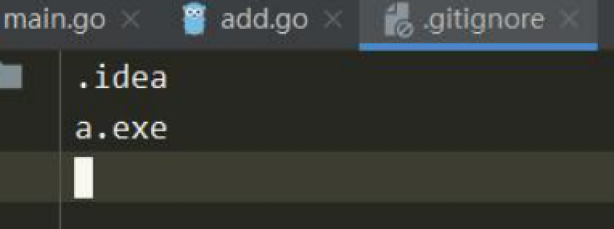
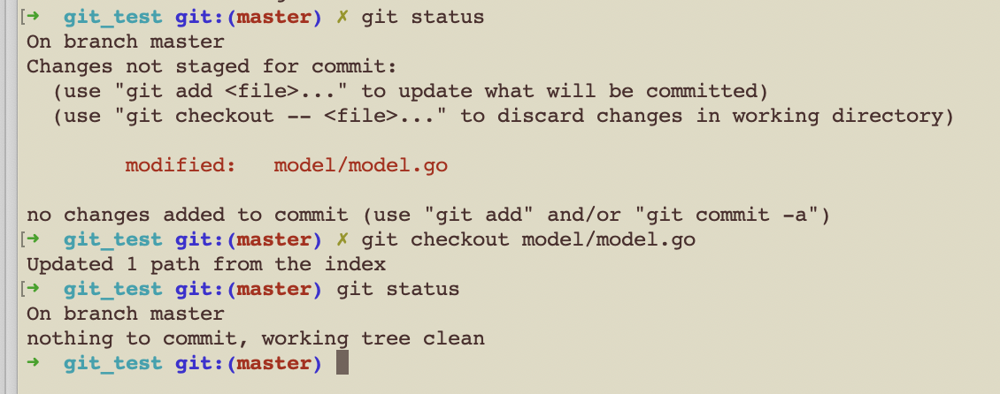

# Git基本操作

## 1. Git安装

1.检查是否安装
> git version

2.安装git

>sudo apt-get install git

3.配置环境
> git config --global user.name "Your Name"
>
> git config --global user.email "email@example.com"

** 注意git config命令的--global参数，用了这个参数，表示你这台机器上所有的Git仓库都会使用这个配置，当然也可以对某个仓库指定不同的用户名和Email地址。** 

## 2.Git的配置

#### 2.1 git安装完之后需要配置自己的信息，使用如下命令

```shell
# 问题1：第一次提交 设置配置
$ git config --global user.name 'Your Name'
$ git config --global user.email 'email@example.com'

# 问题2： 第一提交，编译器不是vim 
$ git config --global core.editor vim
或
$ export GIT_EDITOR=vim
```

#### 2.2 config的三个作用域

```shell
$ git config --local	# 只对当前仓库有效
$ git config --global	# 只对当前登录用户有效
$ git config --system	# 对系统所有用户都有效
$ git config 			# 缺省设置相当于local
```

#### 2.3 显示config的配置  --list

```shell
$ git config --list --local
$ git config --list --global
$ git config --list --system
```

#### 2.4 清除配置  --unset

```shell
$ git config --unset --local user.name
$ git config --unset --global user.name
$ git config --unset --system user.name
```

#### 2.5忽略某些文件 --.gitignore

```shell
# 创建忽略文件
$ touch .gitignore
$ vim .gitignore
# 添加忽略文件 例如：
.idea
a.exe 
# 提交
$ git add .gitignore
```



## 3. Git 操作

### 3.1 拉取远程仓库
> git clone https://github.com/bugfan/authx

### 3.1 将本地代码关联到远端
1.项目目录下初始化本地仓库</br>
>git init

2.推到远程仓库
>git remote add origin https://github.com/bugfan/authx

3.提交本地文件或代码  ** . 代表所有 **
>git add . 

4.将本地代码提交到远端

>git commit -m '内容'

5.推送到远端
>git push -u origin master

6.显示文件状态

> git status

7.显示当前分支的版本历史

> git log 

## 4. 代码回滚

```shell
$ git reset HEAD main.go
$ git reset HEAD^     # 恢复成上次提交的版本
$ git reset HEAD^^    # 恢复成上上次提交的版本，就是多个^，以此类推
$ git reset HEAD~n	# n代表次数，恢复成前面n个提交版本
$ git reflog			# 查看命令历史，以便确定要回到未来的哪个版本。        # 常用
$ git reset --hard 版本号		# 会丢失回退之后的修改，该命令慎用
			--soft：只是改变HEAD指针指向，缓存区和工作区不变；
			--mixed：修改HEAD指针指向，暂存区内容丢失，工作区不变；
			--hard：修改HEAD指针指向，暂存区内容丢失，工作区恢复以前状态；
```


- 情况1: 代码commit但未push，想回到commit状态（保留本次commit代码块）

> $ git reset HEAD^

```shell
$ git log 
```


```shell
$ git reset bfd7b2698079fcdacb9df648345f07a9937ccfb8  
```


- 情况2: 代码commit但未push，想回到commit状态（不保留本次commit代码块）

> $ git reset --hard HEAD^

```shell
$ git log 
```


```shell
$ git reset -hard bfd7b2698079fcdacb9df648345f07a9937ccfb8
```


## 3. 查看历史记录

```shell
$ git log 						# 查看当前分支的记录										** 常用
$ git log --all					# 查看所有分支的记录									** 常用
$ git log -nX 		   	   	  	# X为数字表示次数，查看最近多少次的提交记录
$ git log --oneline 			# 让提交记录以精简的一行输出
$ git log –graph –all --online  # 图形展示分支的合并历史
$ git log --stat 	 			# 简略显示每次提交的内容更改						** 常用
$ git log --name-only 			# 仅显示已修改的文件清单
$ git log --name-status 		# 显示新增，修改，删除的文件清单
$ git log --author=author  	    # 查询作者的提交记录(和grep同时使用要加一个--all--match参数) 
$ git log --grep=过滤信息 		 # 列出提交信息中包含过滤信息的提交记录
$ git log -S查询内容 			 # 和--grep类似，S和查询内容间没有空格
$ git log fileName 				# 查看某文件的修改记录，找背锅专用				** 常用
$ git blame <filename>    # 显示文件最后修改版本和作者						** 常用 背锅常用
$ git log -p  ** 常用 
```


## 4. 暂时保存工作区(stash)

```shell
$ git stash 		# 将当前工作区进行贮藏
$ git stash apply 	# 将贮藏向工作去恢复，不删除贮藏
$ git stash pop		# 将贮藏向工作去恢复，删除贮藏
$ git stash drop 	# 删除贮藏
```


## 5. 重置本次本地提交

```shell
# soucetree <相当于重置到提交>
$ git checkout <filename>   ** 常用
```



## 6.查看变更比较

```shell
$ git diff				# 工作区和暂存区的比较
$ git diff -- 所有文件名	 # 针对文件工作区和暂存区的比较，
$ git diff --catched 	# 暂存区和HEAD的比较
$ git diff --staged		# 暂存区和HEAD的比较
$ git diff branchA branchB -- 所有文件名			# 两个分支的文件比较
$ git diff 版本号A 版本号B -- 所有文件名			# 两个版本号的文件比较
```


## 7.分支管理

#### 7.1 查看分支

```shell
$ git branch  # 查看本地分支
$ git branch -a #查看远程分支
```

#### 7.2 创建分支

```shell
$ git branch dev 		# 创建分支
$ git checkout dev 		# 切换分支
或
$ git checkout -b dev		# -b表示创建并切换分支 <<===推荐使用

# 基于节点创建分支
$ git checkout -b dev	 <节点哈希值>
```

#### 7.3 合并分支

```shell
$ git checkout master
$ git merge sm/dev #合并分支

# 查看已经提交的内容
$ git log -p # <<<<===推荐使用
 git log --graph  # <<== 图形显示
```

#### 7.4 删除分支

```shell
$ git branch -d dev  # 删除分支
$ git branch -D dev  # 强制删除未修改提交的分支

$ git push origin :duke/dev1 # 删除远程分支（推送一个空分支到远程分支，其实就相当于删除远程分支）
或
$ git push origin delete duke/dev
```
#### 7.5.创建远程分支

```shell
# 基于本地分支创建远程分支
$ git push origin duke/dev:duke/dev1  # dev本地分支，dev1远程分支

# 基于远程分支创建本地分支
$ git checkout 
```


## 8.删除文件

```shell
$ git rm <filename>			# 删除文件
# 案例:
$ git rm gitTest.exe
```


## 9.解决冲突

#### 9.1 合并后有冲突(取消本次合并)

```shell
$ git merge --abort  # 取消本次合并
```

#### 9.2 恢复冲突至原本冲突状态

```shell
$ git merge --abort
$ git merge b/dev  #恢复冲突至原本冲突状态  
```

####  9.3 合并错误后(已commit)，恢复到合并前

```shell
$ git reset --hard 45c90469ce2c78eb79332b07587405674ea51fc3
$ git git merge sm/dev
```

####  ==9.4 rebase 合并推荐使用== 

- 合并分支无冲突

```shell
$ git checkout master  # 切换主分支
$ git rebase duke/dev  # 将duke分支合并到主分支
$ git push -u origin master 
```

- 合并后有冲突(恢复冲突至原本冲突状态)

```shell
$ git rebase --abort
```


#### 10.查看某个节点的提交记录代码

```shell
$ git checkout <节点哈希值> #相当于soucetree 里的双击某个提交记录
```


#### 11.==reflog== 查看所有分支的所有操作记录

- ==（包括已经被删除的 commit 记录和 reset 的操作）==

```shell
$ git reflog 
```


## SSH登录

```shell
$ ssh -keygen -t rsa -C "account email"  # 一直按回车就OK
cat id_rsa.pub        ->查看公有密钥，全部复制，添加到github中 公钥一般给leader
# 注意:
	1.git 地址是ssh 而不是http
```

## tag

```shell
$ git tag -a v1.2 9fceb02 -m "my tag" # 给指定的某个commit号加tag
$ git push origin v1.0
或
推送本地所有tag，使用git push origin --tags

$ git tag -d v0.1.2  # 删除
$ git tag v0.1.2 #切换
```


## 案例

```shell
$ git remote -v # 查看远程仓库地址
$ git pull 	# 拉取合并操作
或者
$ git fetch origin duke/mod:duke/mod #<<<=== 推荐使用（只是拉取没有合并） 拉取远程分支

$ git rebase duke/mod # 合并
$ git push -u origin master 
```


