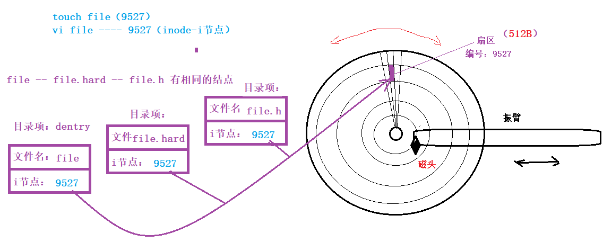

## 系统相关概念

- ==系统调用==：操作系统提供给用户使用的 “函数”。用户使用系统调用，访问操作系统，控制硬件。

- 操作系统地位：承上启下。

## ==Linux目录结构==

1. ”/“ 目录：存放Linux系统的所有目录的。在 Linux 中 有且只有一个 根目录。
2. “/**bin**” 目录：存放二进制的可执行文件。
    1. 终端启动后，默认运行着一个“ 命令解析器（shell/bash）”，接收用户输入，当成命令看待。去掉指定目录下（/bin, /usr/bin），找寻同名可执行文件，运行。
3. “/**dev**”：存放设备文件。
    1. **在Linux系统，一切皆文件**
4. “/**etc**”：存放系统的配置文件。
5. “/**home**”：存放系统用户家目录。
    1. “家目录”（宿主目录）：不是指，/home。 针对itcast用户而言，家目录指 /home/itcast。 通常可以使用 “~”表示。
    2. 终端提示符格式：用户名@主机名:shell工作目录$/#
        1. “$”: 普通用户
        2. “#”：root 超级用户
6. “**/proc**”：存放系统进程相关信息，描述内存中的数据 ( 特性：断电没。)
7. “/**root**”: 是root管理员的家目录。只有root 用户才能访问。
8. “/**tmp**”: 存放临时文件。对任意用户权限开放。
9. “/**var**”:存放系统中经常变化的 文件。如：日志、数据库、邮件。

## 目录访问

- 绝对路径：
    - 从 “/” 开始，找寻访问位置。   cd /home/itcast/go5/

- 相对路径：
    - “.” : 相对于当前目录位置。当前目录。cd . 或 cd ./
    - “..”: 相对于当前目录位置。上一级目录。cd  ../  或 cd .. 

## 查看帮助

- --help：
    - 查看命令的帮助信息。语法： 命令名 --help
- man ：
    - 借助 man 手册，查看帮助信息。
    - man手册：
        - 共 9 卷；使用 man man 查看
        - 需掌握的卷作用：
            - 第1卷：存放 shell命令的 帮助信息。 语法 ：man 1 命令名。
            - 第2卷：存放系统调用。 语法 ：man 2 系统调用名。
            - 第5卷：存放系统文件的格式。语法 ：man 5 文件名。

## 使用技巧：

- ==自动补齐==：Tab键
- history：获取历史执行过的 shell命令。使用 !+序号，执行指定的过往命令。
- 常用热键：
    - ctrl-a：将光标跳转至本行行首。
    - ctrl-e：将光标跳转至本行行尾。
    - ctrl-u：清除光标以前的命令。

## ==常用cd==

- cd 绝对路径：cd  /etc/mysql
- cd 相对路径： cd ../  cd ./xxx
- cd 回车：回当前用户家目录。
- cd ~ : 回当前用户家目录。
- cd - : 切换至上次工作目录中。

## ==ls -l 命令==

- -l 参数：查看文件详细信息：7个部分
    1. 文件权限
    2. 文件硬链接计数
    3. 文件所有者
    4. 文件所属组
    5. 文件大小
    6. 文件创建、最后修改时间
    7. 文件名。
- 文件权限：10个字符组成。分为两部分
    - 第一个字符：==文件类型==
        - Linux操作系统，不以后缀名作为区分文件类型依据。
        - Linux操作系统文件类型：
            - “-”：普通文件		-- 占用磁盘存储。
            - “d”:  目录文件        -- 占用磁盘存储。
            - “l” :  软连接文件    -- 占用磁盘存储。
            - “b”：块设备文件       --伪文件，不占用磁盘存储。
            - “c”：字符设备文件   --伪文件，不占用磁盘存储。
            - “p”：管道文件          --伪文件，不占用磁盘存储。
            - “s”：套接字文件       --伪文件，不占用磁盘存储。
            - Unknown 未知。
    - 剩余9个字符：分3组。每3个字符一组。
        - 第一组：前3字符：代表 “文件所有者权限”
            - 对应：读r、写w、执行x（顺序不能颠倒）
            - 没有对应权限使用 - 表示
        - 第二组：中间3字符：代表 “同组用户权限”
        - 第三组：后3字符：代表“其他人”
- 详细信息中的其他：
    - 文件的硬链接计数：指向同一块扇区，目录项的个数。
    - 文件所有者：创建文件的用户
    - 文件所属组：文件所有者所在组。
    - 文件大小：单位：byte 字节！。目录的默认大小，4k的整数倍。
    - 文件的时间：创建时间 或 最后修改时间。

## ls 命令其他常用参数

- -a ： 查看所有文件信息。
    - Linux 系统中，隐藏文件以 “.” 开头。 touch .file  创建隐藏文件。

- -d：查看目录本身的属性。
    - ls -l 默认操作目录时查看的是目录内容 的详细信息。
    - ls -l -d 目录名。或 ls -ld 目录名。
- -F：查看文件时，带有文件类型提示符。
    - “/”:目录文件
    - “*”：可执行文件
    - “@”: 软连接文件
    - “|”：管道文件。
    - “=”：套接字文件。
- -h：以人类可读的方式添加文件大小的单位。
- -i：查看文件 inode 号。
- 通配符：
    - “*”: 匹配 0-N个任意字符。
    - “?”: 匹配 1个 任意字符。

## 创建文件、目录

- touch ： 创建空文件
    - 语法： touch 文件名。
- mkdir ： 创建空目录
    - 语法：mkdir 目录名 [目录名。。。] 
    - 当一次性创建多级目录时，使用 -p 。 如：mkdir -p a/b/c/d
- rmdir :  删除空目录

## 删除文件、目录

- **==rm命令删除的文件、目录，不能恢复！！！==**
- rm命令：
    - -r：删除目录时，必须添加 -r 参数，recursion递归。
    - -i：与用户实时交互，完成删除。
    - -f：强制执行 rm命令。

## 链接文件

### 硬链接

- 创建语法：ln 源文件名 硬链接文件名。 如 ： ln file file.hard
- 特性：源文件和硬链接文件，同步更新。

- ==操作系统实现原理==：
    - 操作系统管理文件，采用数字代号方式管理。—— inode 或 i节点
    - 每创建一个新的硬链接，就新建一个 “目录项”，目录项主要包含：文件名、inode
    - 源文件和链接文件。包含相同的 inode 

- stat 命令：
    - 语法： stat 文件名
    - 查看文件的状态信息。
- 目录不能创建硬链接。语法不允许。
- 删除硬链接，本质删目录项（硬链接计数-1）。当文件的硬链接计数减为0时，认为该文件被删除。

### 软连接

- 创建语法：ln -s 源文件名 硬链接文件名。 如 ： ln -s file file.soft
- 特性：创建软连接建议使用绝对路径创建。（软链任意搬移不失效）
- 可以给 目录创建 “软连接”

## ==cp命令==

语法：cp  源文件 (目录)  目标文件（目录）

- -r：拷贝目录使用
- -a：拷贝目录使用，保留原属性。
- -i：拷贝的目标位置有同名文件时，询问用户。
- -v：显示拷贝进度。

## ==mv移动、改名命令==

语法：mv 文件目录名    文件目录名

- 移动：
    - 后面目录名存在
- 改名
    - 后面目录名不存在
- 参数：
    - -v：显示进度
    - -i：与用户交互
    - -f：强制操作。

## ==压缩解压==

- ==压缩==：
    - 语法：tar zcvf 压缩包名.tar.gz（.bz2）  原材料
    - 例子：tar zcvf test.tar.gz file1 file2 Testdir p1
- ==解压缩==：
    - 语法：tar zxvf 压缩包名.tar.gz（.bz2）   
    - 例子：tar zxvf test.tar.gz 

- 参数：
    - z：gzip压缩格式。
    - c：创建压缩包。
    - v：显示压缩进度
    - f：指定压缩名。
    - j：指定bzip2压缩格式。
    - ==-C==: 指定解压缩位置。
        - 例子：tar zxvf test3.tar.gz -C ./abc/xyz

## 其他常用命令

- 输出重定向：> 
    - 语法 ： 命令 > 文件名。 
    - 特性：将命令输出的数据，重定向写入 文件中。如果文件不存在自动创建。存在，覆盖。
    - 语法 ： 命令 >> 文件名。   -- 追加数据到文件末尾。
- 读文件：cat
    - 语法：cat 文件名。 
    - 特性：没有指定文件名时，cat 从stdin(标准输入)中读。
    - tac：倒序输出文件信息。

- 读大文件：
    - more：分屏显示大文件
        - 语法：more 文件名
        - 按百分比显示， 空格键，翻一屏。Enter ，翻一行。q 退出。不支持 ↑↓按键
    - less：分屏显示大文件
        - 语法：less 文件名
        - 空格键，翻一屏。Enter ，翻一行。q 退出。支持 ↑↓按键
    - head：显示文件指定前 N 行
        - 语法：head -N 文件名
    - tail：显示文件指定后 N 行
        - 语法：tail -N 文件名
- 管道 “|”：
    - 作用：将前一条命令的输出，作为后一条命令的输入。
    - 最常用命令：ps aux | grep xxx
- pwd:
    - 打印当前 shell 进程工作目录位置。
- which：
    - 查看命令对应的可以执行文件所在目录。

## vim 工具简单使用

1. vim/vi  文件名
2. 按 “i”
3. 编辑。（使用↑↓←→移动光标）
4. 按 esc键。
5. 按 shift -z-z

😯