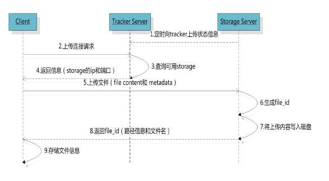
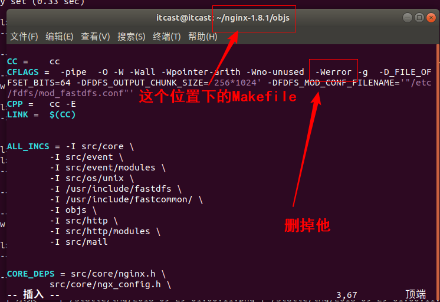
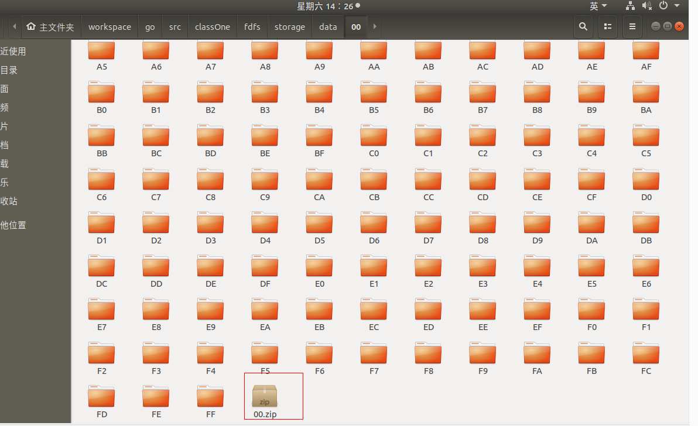
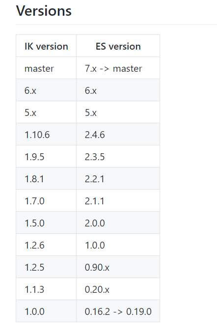

# fastDFS 文件图片上传 

#### 3.2.利用fastDFS存储图片

##### 3.2.1什么是FastDFS

FastDFS 是用 c 语言编写的一款开源的分布式文件系统。FastDFS 为互联网量身定制， 充分考虑了冗余备份、负载均衡、线性扩容等机制，并注重高可用、高性能等指标，使用 FastDFS 很容易搭建一套高性能的文件服务器集群提供文件上传、下载等服务。

优点： 

FastDFS 架构包括 Tracker server 和 Storage server。客户端请求 Tracker server 进行文 件上传、下载，通过 Tracker server 调度最终由 Storage server 完成文件上传和下载。 

Tracker server 作用是负载均衡和调度，通过 Tracker server 在文件上传时可以根据一些 方法找到 Storage server 提供文件上传服务。可以将 tracker 称为追踪服务器或调度服务 器。 

Storage server 作用是文件存储，客户端上传的文件最终存储在 Storage 服务器上， Storageserver 没有实现自己的文件系统而是利用操作系统 的文件系统来管理文件。可以将 storage 称为存储服务器。 


服务端两个角色: 

Tracker:管理集群，tracker 也可以实现集群。每个 tracker 节点地位平等。收集 Storage 集群的状态。 

Storage:实际保存文件 

Storage 分为多个组，每个组之间保存的文件是不同的。每 个组内部可以有多个成员，组成员内部保存的内容是一样的，组成员的地位是一致的，没有 主从的概念。

##### 3.2.2文件上传流程 



客户端上传文件后存储服务器将文件 ID 返回给客户端，此文件 ID 用于以后访问该文 件的索引信息。文件索引信息包括:组名，虚拟磁盘路径，数据两级目录，文件名。


**组名**: 文件上传后所在的 storage 组名称，在文件上传成功后有 storage 服务器返回， 需要客户端自行保存。 

**虚拟磁盘路径**: storage 配置的虚拟路径，与磁盘选项 store_path*对应。如果配置了 store_path0 则是 M00，如果配置了 store_path1 则是 M01，以此类推。 

**数据两级目录 **:storage 服务器在每个虚拟磁盘路径下创建的两级目录，用于存储数据 文件。 

**文件名** :与文件上传时不同。是由存储服务器根据特定信息生成，文件名包含:源存储 服务器 IP 地址、文件创建时间戳、文件大小、随机数和文件拓展名等信息。

##### 3.2.3文件下载流程


##### 3.2.4简易FastDFS架构


##### 3.2.5FastDFS安装

###### 3.2.5.1安装FastDFS依赖包

1. 解压缩libfastcommon-master.zip   
2. 进入到libfastcommon-master的目录中
3. 执行**./make.sh**
4. sudo apt-get install make
5. 执行**sudo ./make.sh install**

###### 3.2.5.2安装FastDFS

1. 解压缩fastdfs-master.zip
2. 进入到 fastdfs-master目录中
3. 执行 **./make.sh**
4. 执行 **sudo ./make.sh install**

###### 3.2.5.3配置跟踪服务器tracker

1. ```shell
   sudo cp /etc/fdfs/tracker.conf.sample /etc/fdfs/tracker.conf
   ```

2. 在/home/itcast/目录中创建目录 fastdfs/tracker      

   ```shell
   mkdir -p /home/itcast/fastdfs/tracker
   ```

3. 编辑/etc/fdfs/tracker.conf配置文件    sudo vim /etc/fdfs/tracker.conf

​        修改 base_path=/home/itcast/fastdfs/tracker

###### 3.2.5.4配置存储服务器storage 

1. ```
   sudo cp /etc/fdfs/storage.conf.sample /etc/fdfs/storage.conf
   ```

2. 在/home/itcast/fastdfs/ 目录中创建目录 storage

   ```shell
   mkdir –p /home/itcast/fastdfs/storage
   ```

3. 编辑/etc/fdfs/storage.conf配置文件  sudo vim /etc/fdfs/storage.conf

   修改内容：

   ```shell
   base_path=/home/itcast/fastdfs/storage
   store_path0=/home/itcast/fastdfs/storage
   tracker_server=自己ubuntu虚拟机的ip地址:22122
   ```

   

###### 3.2.5.5启动tracker和storage

进入到/etc/fdfs/下面执行以下两条指令

```shell
sudo  fdfs_trackerd  /etc/fdfs/tracker.conf
sudo fdfs_storaged  /etc/fdfs/storage.conf
```

###### 3.2.5.6测试是否安装成功

1. **sudo cp /etc/fdfs/client.conf.sample /etc/fdfs/client.conf **
2. 编辑/etc/fdfs/client.conf配置文件  **sudo vim /etc/fdfs/client.conf**

修改内容：

```shell
base_path=/home/itcast/fastdfs/tracker
tracker_server=自己ubuntu虚拟机的ip地址:22122
```

3. 上传文件测试(fastDHT)

   sudo fdfs_upload_file /etc/fdfs/client.conf 要上传的图片文件 

   如果返回类似**group1/M00/00/00/rBIK6VcaP0aARXXvAAHrUgHEviQ394.jpg **的文件id则说明文件上传成功

###### 3.2.5.7安装fastdfs-nginx-module 

1. 解压缩 nginx-1.8.1.tar.gz

2. 解压缩 fastdfs-nginx-module-master.zip

3. 进入nginx-1.8.1目录中

4. 执行

   ```shell
   sudo ./configure  --prefix=/usr/local/nginx/ --add-module=/home/itcast/fdfs/fastdfs-nginx-module-master/src
   ```

   注意：**这时候会报一个错，说没有PCRE库**

   

   下载缺少的库

   ```shell
   sudo apt-get install libpcre3 libpcre3-dev 
   ```

   + 首先你需要去更换源，因为ubuntu自带的源没有这个库

   + 更换下载源为阿里的源

   + 先把原来的源文件备份

     ```shell
     sudo cp /etc/apt/sources.list /etc/apt/sources.list.bak
     ```

   + 编辑源文件

     ```shell
     sudo vim /etc/apt/sources.list
     ```

     把原来的内容全部删掉，粘贴一下内容：

     ```shell
     deb http://mirrors.aliyun.com/ubuntu/ bionic main restricted universe multiverse
     deb-src http://mirrors.aliyun.com/ubuntu/ bionic main restricted universe multiverse
      
     deb http://mirrors.aliyun.com/ubuntu/ bionic-security main restricted universe multiverse
     deb-src http://mirrors.aliyun.com/ubuntu/ bionic-security main restricted universe multiverse
      
     deb http://mirrors.aliyun.com/ubuntu/ bionic-updates main restricted universe multiverse
     deb-src http://mirrors.aliyun.com/ubuntu/ bionic-updates main restricted universe multiverse
      
     deb http://mirrors.aliyun.com/ubuntu/ bionic-proposed main restricted universe multiverse
     deb-src http://mirrors.aliyun.com/ubuntu/ bionic-proposed main restricted universe multiverse
      
     deb http://mirrors.aliyun.com/ubuntu/ bionic-backports main restricted universe multiverse
     deb-src http://mirrors.aliyun.com/ubuntu/ bionic-backports main restricted universe multiverse
     ```

     更换完源之后执行  

     ```shell
     sudo apt-get  update
     sudo apt-get install libpcre3 libpcre3-dev
     ```
     
     安装 zlib
     ```
     sudo apt-get install ruby
     sudo apt-get install zlib1g
     sudo apt-get install zlib1g.dev
     ```

     然后进入nginx-1.8.1目录中，再次执行：

     ```shell
     sudo ./configure  --prefix=/usr/local/nginx/ --add-module=/home/itcast/fastDFS/fastdfs-nginx-module-master/src
     ```

     然后编译：

     ```shell
     sudo make
     ```

     这时候还会报一个错（错误还真多），错误原因是因为nginx编译的时候把警告当错误处理，事实上这个警告并不影响（程序员忽略警告）：

     

     解决方法：

     找到objs目录下的Makefile

     vim Makefile

     删掉里面的-Werror(**如果没有修改权限，修改一下这个文件的权限,`chmod 777 Makefile`**)

     

     然后回到nginx-1.8.1目录中

     执行完成后继续执行**sudo make**

     执行**sudo make install** 

     

5. sudo cp fastdfs-nginx-module-master解压后的目录中src下mod_fastdfs.conf   /etc/fdfs/mod_fastdfs.conf

6. sudo vim /etc/fdfs/mod_fastdfs.conf

   修改内容：

   ```shell
   connect_timeout=10
   tracker_server=自己ubuntu虚拟机的ip地址:22122
   url_have_group_name=true
   store_path0=/home/itcast/fastdfs/storage
   ```

7. sudo cp 解压缩的fastdfs-master目录中的conf中的http.conf  /etc/fdfs/http.conf

8. sudo cp 解压缩的fastdfs-master目录中conf的mime.types /etc/fdfs/mime.types

9. sudo vim /usr/local/nginx/conf/nginx.conf

   在http部分中添加配置信息如下：

   ```shell
   server {
               listen       8888;
               server_name  localhost;
               location ~/group[0-9]/ {
                   ngx_fastdfs_module;
               }
               error_page   500 502 503 504  /50x.html;
               location = /50x.html {
               root   html;
               }
           }
   
   ```

10. 启动nginx

  sudo  /usr/local/nginx/sbin/nginx

##### 3.2.6使用go客户端上传文件测试

+ 下载包

  ```shell
  go get -u -v github.com/weilaihui/fdfs_client
  ```

  这时候会报一个错：

  

  这是因为我们的网络有长城防火墙，不能直接去google下载相应的包，所以就失败啦

  解决办法：

  + 在`~/workspace/go/src`目录下面创建一个golang.org/x目录

    ``` shell
    cd  ~/workspace/go/src
    mkdir -p golang.org/x
    ```

  + 进入golang.org/x下载两个包

    ```shell
    cd golang.org/x
    git clone https://github.com/golang/crypto.git
    git clone https://github.com/golang/sys.git
    ```

  + 然后再执行最初的下载命令

    ```shell
    go get github.com/weilaihui/fdfs_client
    ```

+ go操作fastDFS的方法

  + 先导包，把我们下载的包导入

    ```go
    import "github.com/weilaihui/fdfs_client"
    ```

  + 导包之后,我们需要指定配置文件生成客户端对象

    ```go
    client,_:=fdfs_client.NewFdfsClient("/etc/fdfs/client.conf")
    ```

  + 接着我们就可以通过client对象执行文件上传，上传有两种方法，一种是通过文件名，一种是通过字节流

    + 通过文件名上传**UploadByFilename **,参数是文件名（必须通过文件名能找到要上传的文件），返回值是fastDFS定义的一个结构体，包含组名和文件ID两部分内容

      ```go
      fdfsresponse,err := client.UploadByFilename("flieName")
      ```

    + 通过字节流上传**UploadByBuffer**,参数是字节数组和文件后缀，返回值和通过文件名上传一样。

      ```go
      fdfsresponse,err := client.UploadByBuffer(fileBuffer,ext)
      ```

#### 3.3.改用fastDFS上传文件

​	我们以前保存视图传递过来的文件方法是先用GetFile()获取文件相关信息，然后再用SaveToFile()把文件保存到 文件夹下面。以前保存图片的代码如下：

```go
func UploadImage(this*beego.Controller,filePath string)string{
	//1.那数据
	//那标题
	f,h,err:=this.GetFile(filePath)

	defer f.Close()
	//上传文件处理
	//1.判断文件格式
	ext := path.Ext(h.Filename)
	if ext != ".jpg" && ext != ".png"&&ext != ".jpeg"{
		beego.Info("上传文件格式不正确")
		return ""
	}

	//2.文件大小
	if h.Size>5000000{
		beego.Info("文件太大，不允许上传")
		return ""
	}

	//3.不能重名
	fileName := time.Now().Format("2006-01-02 15:04:05")


	err2:=this.SaveToFile(filePath,"./static/img/"+fileName+ext)
	if err != nil{
		beego.Info("上传文件失败")
		return ""
	}

	if err2 != nil{
		beego.Info("上传文件失败",err2)
		return ""
	}
	return "/static/img/"+fileName+ext
}
```

我们现在要用fastDFS来存储图片，第一步也是先用GetFile拿到文件，但是第二步，我们用UploadByBuffer()把静态文件存到我们fastDFS文件系统中。

```go
//先导包
import "github.com/weilaihui/fdfs_client"

//通过GetFile获取文件信息
f,h,err := this.GetFile(filePath)
defer f.Close()
//然后对上传的文件进行格式和大小判断
//1.判断文件格式
ext := path.Ext(h.Filename)
if ext != ".jpg" && ext != ".png"&&ext != ".jpeg"{
	beego.Info("上传文件格式不正确")
	return ""
}

//2.文件大小
if h.Size>5000000{
	beego.Info("文件太大，不允许上传")
	return ""
}
//3.上传文件
//先获取一个[]byte
fileBuffer := make([]byte,h.Size)
//把文件数据读入到fileBuffer中
f.Read(fileBuffer)
//获取client对象
client := fdfs_client.NewFdfsClient("/etc/fdfs/client.conf")
//上传
fdfsresponse,_:=client.UploadByBuffer(fileBuffer,ext[1:])
//返回文件ID
return fdfsresponse.RemoteFileId
```

上传图片方式修改完成之后我们添加类型就业务就结束了。


**我们这里就直接导入数据，不再一步步的添加数据**

#### 3.5导入商品有关数据

##### 3.5.1导入数据库数据

​	导入数据库数据，老师给你们的资料中，有一个文件是` dailyfresh.sql`,就是我以前导入的数据，你们可以把这个sql语句导入到你们的数据库中，直接拿来使用。

+ 先进入数据库中

  ```shell
  mysql -uroot -p123456
  ```

+ 选中项目中用到的数据库

  ```shell
  use pyg
  ```

+ 导入文件(保证dailyfresh.sql文件在你当前目录下面)

  ```shell
  source fresh.sql
  ```

+ 查看数据是否导入成功

  ```shell
  select * from goods_type;
  ```

##### 3.5.2导入图片数据

​	导入数据库数据之后我们还有很多图片内容是存在fastDFS中的，也需要我们手动导入

+ 删除` ~/fdfs/storage/data/00`目录下的00文件夹

+ 把课堂资料中的00.zip拷贝到我们存放图片的路径下面` ~/fdfs/storage/data/00`

  

+ 解压00.zip到当前目录

***这时候我们就把数据全部导入到了我们的开发环境当中。***


### 4.搜索页面商品内容展示（老版）

接着我们来实现商品模块的最后一个内容，商品搜索。

在实现相关内容之前需要给大家先介绍一个内容，**ORM过滤器的高级用法**

我们在前面用过滤器Filter的时候，只能过滤相等的情况，但是在实际业务开发中，我们不止会遇到相等的情况，还有大于，小于，大于等于，小于等于，包含，以某个字符开始，以某个字符结束等相关查询操作，那这些功能在我们过滤器中是怎么实现呢？我们通过下面的例子来说明，举例如下：

```go
qs.Filter("profile__age__gt", 18) // WHERE profile.age > 18   查询profile表中age属性大于18的值
```

通过上面的例子，我们能看到如果要使用过滤器的高级用法，需要在第一个参数后面再追加上`__`然后跟上相应的操作符号，来表示不同的需求。那这些单词都有哪些呢？我们通过下面的表来做一个简单的了解:

|         操作符         |                             作用                             |
| :--------------------: | :----------------------------------------------------------: |
|      exact/iexact      |             判断指定的字段是否等于第二个参数的值             |
|   contains/icontains   |             判断指定的字段是否包含第二个参数的值             |
|        gt / gte        |        判断指定的字段是否大于/大于等于第二个参数的值         |
|        lt / lte        |        判断指定的字段是否小于/小于等于第二个参数的值         |
| startswith/istartswith |          判断指定的字段是否是以第二个参数的值为开头          |
|   endswith/iendswith   |          判断指定的字段是否是以第二个参数的值为结尾          |
|         isnull         |                   判断指定的字段是否为null                   |
|           in           | 判断指定的字段是否在第二个参数内部（这时候第二个参数一般为切片，也可以多放几个参数） |

> 注意：这里成对出现，并且以**i**开头的表示：大小写不敏感 

了解了上面的知识点之后我们就可以用contains来查询我们的商品数据。

**请求**

搜索的请求需要把搜索框的数据发送给后台，所以我们需要先在两个input标签外边加上form标签，然后给form表单中给搜索添加action。代码如下:

```html
<form method="post" action="/searchGoods">
    <input type="text" class="input_text fl" name="goodsName" placeholder="搜索商品">
    <input type="submit" class="input_btn fr" name="" value="搜索">
</form>
```

**路由**

有了请求，接着去router.go文件中给请求添加对应的控制器和方法。代码如下：

```go
//搜索功能
beego.Router("/searchGoods",&controllers.GoodsController{},"post:HandleSearch")
```

**控制器**

接着我们去实现HandleSearch方法，一就是我们的四步骤：

+ 获取数据

  ```go
  goodsName := this.GetString("goodsName")
  ```

+ 校验数据

  这里需要注意的是，如果我们搜索框传递过来的数据为空，这时候我们应该怎么处理？暂时我们处理的是如果搜索框传递数据为空，那么我们就获取全部商品数据。

  ```go
  if goodsName == ""{
  	beego.Info("查找的数据为空")
  	o.QueryTable("GoodsSKU").All(&goods)
  	this.Data["goods"] = goods
  	ShowLayout(&this.Controller)
  	this.TplName = "search.html"
  }
  ```

+ 处理数据

  这时候我们拿到了搜索关键字，那我们就根据这个关键字进行搜索。代码如下：

  ```go
  //根据拿到的数据进数据库查询
  o := orm.NewOrm()
  var goods []models.GoodsSKU
  o.QueryTable("GoodsSKU").Filter("Name__icontains",goodsName).All(&goods)
  ```

+ 返回视图

  这时候需要注意的时候，我们给的页面里面没有搜索结果页面，所以需要我们自己创建一个搜索页面。这里我们修改一下商品列表页，充当我们的搜索结果页。修改之后的代码如下：

  ```html
  <div class="breadcrumb">
  	<a href="#">全部分类</a>
  	<span>></span>
  	<a href="#">搜索界面</a>
  </div>
  
  <div class="main_wrap clearfix">
  
  	<div class="r_wrap fr clearfix">
  		<ul class="goods_type_list clearfix">
  			{{range .goods}}
  				<li>
  					<a href="/goodsDetail?id={{.Id}}"></a>
  					<h4><a href="/goodsDetail?id={{.Id}}">{{.Name}}</a></h4>
  					<div class="operate">
  						<span class="prize">￥{{.Price}}</span>
  						<span class="unit">{{.Price}}/{{.Unite}}</span>
  						<a href="#" class="add_goods" title="加入购物车"></a>
  					</div>
  				</li>
  			{{end}}
  		</ul>
  
  	</div>
  </div>
  ```

  后台代码处理：

  ```go
  //指定视图
  ShowLayout(&this.Controller)
  this.TplName = "serach.html"
  ```

  
  
### 新版搜索

 上面的搜索底层用的是关系数据库中like关键字实现的，但是like关键字的效率极低，而且查询需要在多个字段中进行，使用like关键字也不方便。

所以我们引入搜索引擎来实现全文检索。

全文检索即在指定的任意字段中进行检索查询。

#### 1.搜索引擎原理

通过搜索引擎进行数据查询时，搜索引擎并不是直接在数据库中进行查询，而是搜索引擎会对数据库中的数据进行一遍预处理，单独建立起一份索引结构数据。

我们可以将索引结构数据想象成是字典书籍的索引检索页，里面包含了关键词与词条的对应关系，并记录词条的位置。

  

我们在通过搜索引擎搜索时，搜索引擎将关键字在索引数据中进行快速对比查找，进而找到数据的真实存储位置。

# 2.Elasticsearch介绍

开源的 [Elasticsearch ](https://www.elastic.co/)是目前全文搜索引擎的首选。

它可以快速地储存、搜索和分析海量数据。维基百科、Stack Overflow、Github 都采用它。

Elasticsearch 的底层是开源库 [Lucene](https://lucene.apache.org/)。但是，你没法直接用 Lucene，必须自己写代码去调用它的接口。Elastic 是 Lucene 的封装，提供了 REST API 的操作接口，开箱即用。

Elasticsearch 是用Java实现的。

搜索引擎在对数据构建索引时，需要进行分词处理。分词是指将一句话拆解成多个单字或词，这些字或词便是这句话的关键词。如

```python
我是中国人。
```

'我'、'是'、'中'、'国'、'人'、'中国'等都可以是这句话的关键词。

Elasticsearch 不支持对中文进行分词建立索引，需要配合扩展**elasticsearch-analysis-ik**来实现中文分词处理。

#### 3.Elasticsearch及其扩展安装

+ 安装java环境

  > 在线安装,需要下载二百多兆安装数据，进公司可以这么安装

  ```bash
  sudo apt install default-jdk
  ```

  > 离线安装
  >
  > 1.下载jdk（java安装包,已下载）
  >
  > 下载连接：http://www.oracle.com/technetwork/java/javase/downloads/index.html
  >
  > 2.解压并移动到指定目录
  >
  > tar -zxvf jdk-12.0.2_linux-x64_bin.tar.gz 
  >
  > sudo mv  jdk-12.0.2  /usr/local/java
  >
  > 3.进行配置
  >
  > 打开家目录下面的.bashrc文件,在文件末尾加上如下配置。
  >
  > ```bash
  > export JAVA_HOME=/usr/local/java
  > export CLASSPATH=JAVA_HOME/lib:{JRE_HOME}/lib  
  > 
  > export PATH=JAVA_HOME/bin:PATH
  > ```
  >
  > 4.让配置生效
  >
  >  source .bashrc
  >
  > 5.测试是否安装成功
  >
  > java -version

+ 安装elasticsearch

  > 获取elasticsearch

  wget https://artifacts.elastic.co/downloads/elasticsearch/elasticsearch-7.2.0-amd64.deb

  > 解压文件

  sudo dpkg -i elasticsearch-7.2.0-amd64.deb

  > 重新生成ubuntu之间的依赖关系

  sudo systemctl daemon-reload

  > 设置开机自启动

  sudo systemctl enable elasticsearch.service

  > 开启elasticsearch服务

  sudo systemctl start elasticsearch


+ 编辑配置项

  sudo vim /etc/elasticsearch/elasticsearch.yml 

  去掉下面三行的注释

  ```shell
  bootstrap.memory_lock: true  
  network.host: 192.168.0.1  
  http.port: 9200 
  ```

  然后把 network.host对应的改成 localhost

+ 再次重启

  ```shell
  sudo systemctl daemon-reload  
  sudo systemctl enable elasticsearch.service  
  sudo systemctl start elasticsearch 
  ```

+ 查看服务是否开启成功

  netstat -plntu 

  

+ 重新启动并测试

  ```shell
  sudo systemctl restart elasticsearch  
  curl 'localhost:9200'   
  ```

  

+ 安装ik分词器

  不同版本的elasticsearch对应不同版本的ik分词器，对应如下：

  

  安装

  ```
  shell
  sudo /usr/share/elasticsearch/bin/elasticsearch-plugin install https://github.com/medcl/elasticsearch-analysis-ik/releases/download/v7.2.0/elasticsearch-analysis-ik-7.2.0.zip 
  ```

s