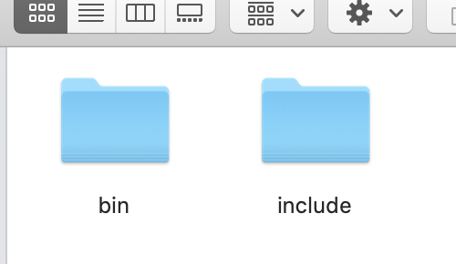

# protoc 安装及使用

[参考文献](https://juejin.im/post/5b852d476fb9a019e4505873)

## ==1.大端法小端法==

```json
大端序（big-endian）和小端序（little-endian）统称为字节顺序。
对于多字节数据，例如 32 位整数占据 4 字节，在不同的处理器中存放方式也不同，以内存中 0x0A0B0C0D 的存放方式为例：
在大端序中，如果数据以 8bit 为单位进行存储，则最高位字节 0x0A 存储在最低的内存地址处。

地址增长方向  →
0x0A, 0x0B, 0x0C, 0x0D

如果数据以 16bit 为单位进行存储，则最高的 16bit 单元 0x0A0B 存储在低位:
地址增长方向  →
0x0A0B, 0x0C0D

而小端序则与此相反。目前大多数主流 CPU 都是小端序的，这也是 Cap'n Proto 采用小端序的原因。

如果熟悉 C 或者 C++ 的结构体，可以看到 Cap'n Proto 的编码方式跟 struct 的内存结构很相似。即使在 V8 引擎内部，也是使用了类似的结构来进行属性的快速读取。相比使用 Hash Map 有很高的性能提升。
```


## ==2.protobuf下载==

```json
下载地址地址：
	https://github.com/protocolbuffers/protobuf/releases/tag/v3.10.0
Mac版本:
	protoc-3.10.0-osx-x86_64.zip
```


## 3.指定文件目录

- ==下载完毕后，解压 protoc-3.10.0-osx-x86_64.zip 压缩包==




- ==将解压文件放指定目录==

  ```shell
  # 将bin目录内的protoc拷贝至/usr/local/bin文件目录下
  $ cp protoc /usr/local/bin  
  
  # 将include目录内的google文件拷贝至于/usr/local/include文件目录下
  $ cp google /usr/local/include  
  ```

  

## ==4. 安装protoc-gen-go中间件==

```shell
# 安装protoc-gen-go，安装路径在$GOPATH/src/github.com/目录下
$ go get -u github.com/golang/protobuf/protoc-gen-go
```


## 5.protoc使用语法

- ==文件目录pb/test.proto  ** 严格执行文件目录结构 pb/xxx==

```protobuf
//1. 指定proto的版本号
syntax = "proto3";

//2. 生成go语言的包名
package pb;

//3. 定义结构体
// message 关键字
message Person{
//字段必须有编号 1,2
	string Name = 1;	//注意=号后面有空格
	int32 Age = 2;
}
```


## ==6.protoc编译==

```shell
# go_out 输出
# 第一个. 当前文件目录下
# 第二个*.proto 编译所有的.proto文件
$ protoc --go_out=. *.proto
```


## ==7.序列化与反序列化==

```go
/* 定义结构体 */
lisa := pb.Person{
		Name:"lisa",
		Age:20,
}

/* 反序列化 */
data,err:=proto.Marshal(&lisa)
if err!=nil {
	fmt.Println("Marshal err",err)
	return
}

/* 序列化 */
var stu pb.Person
err=proto.Unmarshal(data,&stu)
if err!=nil {
	fmt.Println("Unmarshal err",err)
	return
}
fmt.Println("Name:",stu.Name,",Age:",stu.Age)
```


