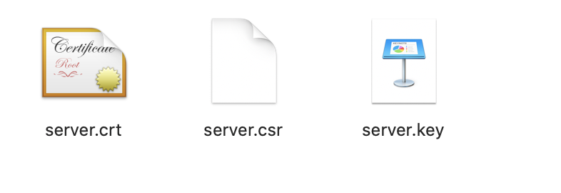

# 证书

## 1.生成自签名证书

- ==自签名证书，自己颁发给自己，自己验证自己。==

```shell
# 创建CA的私钥
$ openssl genrsa -out server.key 1024
# 或者
$ openssl genrsa -des3 -out server.key 1024 # 使用des3加密

# 生成CSR（证书签名请求）
$ openssl req -new -key server.key -out server.csr

# 查看CSR证书请求信息
$ openssl req -in server.csr -text

# 生成自签名证书
$ openssl x509 -req -days 365 -in server.csr -signkey server.key -out server.crt

# 查看自签名证书
$ openssl x509 -in server.crt -text
```

- 生成效果图


- 点击server.crt ，添加证书


## 2.==创建CA证书，给第三方签发证书==

```shell
# 第一步：创建CA私钥
$ openssl genrsa -out ca.key 1024

# 第二步：生成CA的自签名证书
$ openssl req -new -x509 -days 365 -key ca.key -out ca.crt

# 第三步：生成需要的颁发证书私钥
$ openssl genrsa -out server.key 

# 第四步：生成要颁发证书的签名请求
$ openssl req -new -key server.key -out server.csr

# 第五步：用第二步创建的CA证书给第四步生成的签名请求进行签名
$ openssl x509 -req -days 365 -in server.csr -CA ca.crt -CAkey ca.key -set_serial 01 -out server.crt
```

