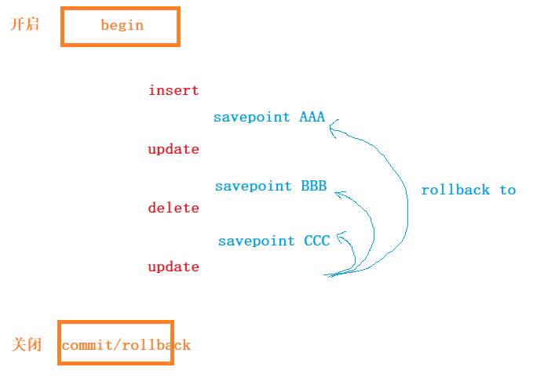
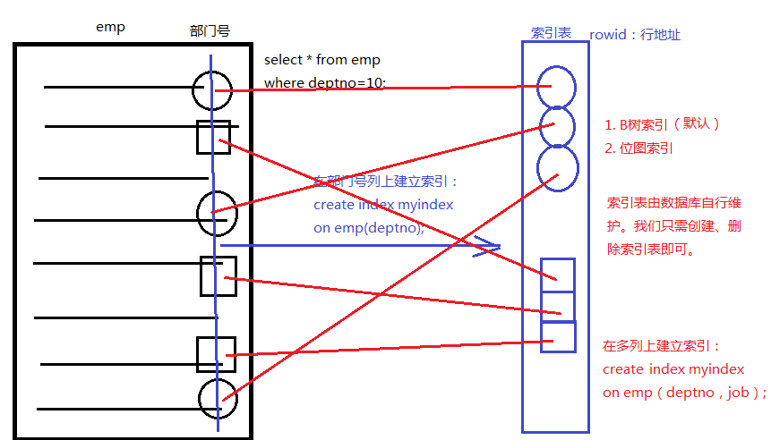
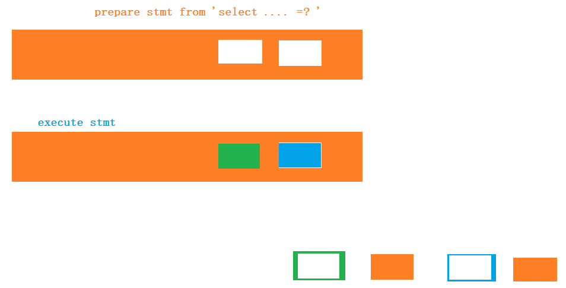

```sql
UPDATE stu set ch = ch+1
where stuno in (
	select stuNo
	from (
		select *, ch+math 总成绩
		from stu
		order by 总成绩 desc
		limit 3
	)mystu
) 
```


## 事务

### 概念

- 一次性执行多条 sql 语句， 要么都成功，要么都失败。
- 特性：
    - 包含 DML语句、DDL语句、DCL语句。
    - **MySQL数据库中，只有InnoDB引擎，支持事务！！！**


### 事务的使用：

- 开启事务：
    - begin [work]
    - start transaction
- 关闭事务：
    - 显示关闭事务：
        - 显示提交：commit （前提：事务已经开启）
        - 显示回滚：rollback （前提：事务已经开启）
    - 隐式关闭事务：
        - 隐式提交：执行 DDL语句（create、drop、truncate。。。）
        - 隐式回滚：掉电、宕机、异常终止。 显示退出：exit、quit

### 保存点（回滚点）

- 使用步骤：

    1. 开启事务 begin、start transaction
    2. 执行 DML 语句修改数据表。
    3. 设置回滚点 savepoint 回滚点名（自定义) ;
    4. 重复 2/3 步骤
    5. 使用 rollback  to 指定回滚点回退。（没有关闭事务）
    6. 使用commit/rollback  关闭事务。

    

### 事务4大特性：

1. 原子性：
2. 一致性：
3. **隔离性**：
4. 持久性：


## 视图

### 视图简介

- 视图不是表，不存储表数据。只是描述一张或多张表的虚拟结构。
- 使用视图不能提高数据库的访问效率。简化SQL的实现。

### 视图作用

1. 隐藏表结构
2. 不暴露表敏感信息。
3. 简化SQL语句。


### 创建视图

- 创建视图的语法

```sql
create [or replace] view 视图名
as
select 查询表语句。		-- 借助表或多张表创建视图：

create view vw_stu
as
SELECT stuno, stuname, stuAge, writtenExam, labExam
from stuinfo NATURAL join stumarks
```


### 查看视图

#### 查看自定义视图

- desc 视图名

```sql
-- 查看视图的结构（与表结构体一致。）
mysql> desc vw_stu;
+-------------+-------------+------+-----+---------+-------+
| Field       | Type        | Null | Key | Default | Extra |
+-------------+-------------+------+-----+---------+-------+
| stuno       | char(6)     | NO   |     | NULL    |       |
| stuname     | varchar(10) | NO   |     | NULL    |       |
| stuAge      | tinyint(4)  | NO   |     | NULL    |       |
| writtenExam | int(11)     | YES  |     | NULL    |       |
| labExam     | int(11)     | YES  |     | NULL    |       |
+-------------+-------------+------+-----+---------+-------+

```

- show create view 视图名

```sql
mysql> show create view vw_stu;
```

 #### 查看mysql数据库中的 视图

- show tables；
- select table_name from infomation_schma.views\G
- show table status where comment=‘view’\G

### 删除视图

- 语法：drop view [if exists] 视图名,视图名,视图名, 。。。

    ```sql
     drop view if exists vw_stu;
    ```


## 索引

### 索引简介

- 索引表优点：
    - 提高查询速度。
- 索引表缺点：
    - 增、删、改效率低。
    - 额外占用存储空间。
- 索引表的使用特性：
    - 只需要创建、删除索引表即可。不需要维护。MySQL系统自动管理。




### 创建索引

#### 创建表指定索引

- 语法：

    ```sql
    create tble 表名(
        字段名 类型，
        字段名 类型，
        ...
        key `索引名`(字段名)
    )
    ```

#### 修改表指定索引

- 语法1：

    ```sql
    alter table 表名 add index [索引名](字段名);  -- 索引名可以省略
    ```

- 语法2

    ```sql
    create index `索引名` on 表名(字段名);	-- 索引名不可以省略
    ```

    

### 查看、删除索引

- 查看索引

    ```sql
     show create table 表名; -- 得到索引名
    ```

- 删除

    ```sql
     drop index 索引名 on 表名;
     
     alter table 表名 drop index `索引名`;
    ```

    

### 索引创建的指导原则

1. 用于频繁搜索的列，适合创建索引。
2. 用于排序的列，适合创建索引。
3. 公共字段，适合创建索引。
4. 表的数据量较少，无需创建索引。
5. 列的取值在很小的范围内（枚举、集合），无需创建索引。


## 预处理SQL

- 使用场景：
    - 同一格式的SQL语句，反复执行场景。
- 使用步骤：
    1. 创建带有占位符（?）预处理语句，将SQL编译。
        - prepare stmt from ‘select xxxxx = ?, = ?’
    2. 创建变量，赋初值
        - set @变量名=变量值，@变量名=变量值
    3. 执行预处理语句，并传参。
        - execute stmt using @变量名，@变量名

- 原理：




## Go程序操作MySQL


### Linux 系统的MySQL驱动

1. 查看是否包含驱动。find ~/ -name “go-sql-driver”
2. 如果当前系统没有该驱动目录，使用  go get github.com/go-sql-driver/mysql。 自动去github.com官网下载对应的 go 驱动包，存放到 GoPath 指定的目录下。
3. 再次使用 find ~/ -name “go-sql-driver” 找到驱动目录 ， cd 进入。
4. ls -l | wc -l 统计驱动目录下的 文件数。（大约30+）


### 测试连接MySQL

1. 导入驱动包、函数库包

    ```go
    import (
       "database/sql"		// 数据库操作函数，使用的包
       _ "github.com/go-sql-driver/mysql"   // 驱动包。
    )
    ```

2. 创建 数据库绑定对象 DB

    ```go
    func Open(driverName, dataSourceName string) (*DB, error)
    参数1：驱动名。 “mysql”
    参数2：数据库连接信息：
    	语法格式：用户名:密码@[连接方式](MySQL服务器所在主机IP地址:端口号)/数据库名
    	root:123456@tcp(127.0.0.1:3306)/mydb2
    返回值：DB：数据库绑定对象 （类别open文件，得到的文件指针）
    	open函数返回的DB对象，不能操作数据库。
    ```

3. 连接数据库

    ```go
    func (db *DB) Ping() error
    当ping() 函数成功返回时， DB就真正指向了对应数据库。可以操作数据库。
    ```

    

#### 编码实现

```sql
import (
	"database/sql"
	_ "github.com/go-sql-driver/mysql"
	"fmt"
)
func main() {
	// 创建 数据库绑定对象 DB
	db, err := sql.Open("mysql", "root:123456@tcp(127.0.0.1:3306)/mydb2")
	if err != nil {
		fmt.Println("Open err:", err)
		return
	}
	defer db.Close()

	// 链接数据库
	err = db.Ping()
	if err != nil {
		fmt.Println("Ping err:", err)
		return
	}
	// 代表数据库链接成功!!!
	fmt.Println("数据库链接成功!!!")
}
```


### 插入数据

#### 单行、多行插入

1.  准备 sql 语句

    1. 单行：insert into 表名 values(值)
    2. 多行：insert into 表名 values(值)，（值），（值）。。。

2. 使用 db下的 Exec执行sql 语句

    ```sql
    func (db *DB) Exec(query string, args ...interface{}) (Result, error)
    参1：sql语句
    参2：参数。（无参）
    返回值：sql执行后的返回结果。
    
    type Result interface {
        LastInsertId() (int64, error)  // 自动增长值
        RowsAffected() (int64, error)  // sql执行后的 影响行数
    }
    ```

3. 获取 RowsAffected() 的返回值，拼接sql语句执行的结果。

- 编码实现

```sql
	// 单行插入
/*	// 定义插入数据库的sql
	sql := `insert into st7 values(2, 'BBB')`

	result, err := db.Exec(sql)
	if err != nil {
		fmt.Println("Exec err:", err)
		return
	}
	ret, err := result.RowsAffected()
	if err != nil {
		fmt.Println("RowsAffected err:", err)
		return
	}
	fmt.Printf("Query ok! %d rows Affected\n", ret)*/

	// 定义插入数据库的sql
	sql := `insert into st7 values(3, '李逵'),(4, '张飞'),(5,'程咬金')`

	result, err := db.Exec(sql)
	if err != nil {
		fmt.Println("Exec err:", err)
		return
	}
	ret, err := result.RowsAffected()
	if err != nil {
		fmt.Println("RowsAffected err:", err)
		return
	}
	fmt.Printf("Query ok! %d rows Affected\n", ret)
```


#### 预处理插入

1.  创建带有占位符的 sql 语句	 insert into st7 values(?,?);

2.  创建预处理语句

    ```go
    func (db *DB) Prepare(query string) (*Stmt, error)
    参：带有占位符的sql
    返回值：创建成功的预处理对象（本质struct）
    ```

3. 执行预处理语句，并传参

    ```go
    func (s *Stmt) Exec(args ...interface{}) (Result, error)
    参数：给预处理语句stmt传参。 简化操作，参数类型无需与数据库数据类型完全一致，MySQL系统会自动转换
    返回值：同 单行、多行插入。
    ```

- 编码实现

    ```go
    // 创建带有占位符sql语句
    sql := `insert into st7 values(?,?)`
    
    // 创建预处理语句
    stmt , err := db.Prepare(sql)
    if err != nil {
        fmt.Println("Prepare err:", err)
        return
    }
    defer stmt.Close()
    
    // 准备要插入数据库的数据
    data := [][]string{{"6", "李白"}, {"7", "杜甫"}, {"8", "陆游"}}
    
    // 执行预处理语句,并传参
    for _, v := range data {
        stmt.Exec(v[0], v[1])
    }
    fmt.Println("Query ok! Insert 成功!!")
    ```

    

### 查询数据

#### 单行查询

1. 组织查询一条记录的 sql  := select * from st7 where id = 5;

2. 调用 单行查询函数。QueryRow() -- row

    ```go
    func (db *DB) QueryRow(query string, args ...interface{}) *Row
    参1：sql语句
    参2：无参
    返回值：一条记录的数据结果。（本质struct）
    ```

3. 根据表的字段数、类型，创建变量 id、name

4. 使用 row.Scan() 函数，接收数据值，保存到变量中。

    ```go
    func (r *Row) Scan(dest ...interface{}) error
    ```

- 编码实现：

    ```go
    func main() {
    	// 创建 数据库绑定对象 DB
    	db, err := sql.Open("mysql", "root:123456@tcp(127.0.0.1:3306)/mydb2")
    	if err != nil {
    		fmt.Println("Open err:", err)
    		return
    	}
    	defer db.Close()
    
    	// 链接数据库
    	err = db.Ping()
    	if err != nil {
    		fmt.Println("Ping err:", err)
    		return
    	}
    	// 代表数据库链接成功!!!
    	fmt.Println("数据库链接成功!!!")
    
    	// 组织返回一行结果的查询语句
    	sql := `select * from st7 where id=6`
    
    	// 执行查询单行的sql函数, 查询的结果,保存在返回的 row 中
    	row := db.QueryRow(sql)
    
    	// 根据表的字段个数,类型,定义变量接收数据
    	var id int
    	var name string
    
    	// 调用row 对象的方法,获取 表数据
    	row.Scan(&id, &name)
    
    	fmt.Println("查询结果为:", id, "-", name)
    ```

    

#### 多行查询

1. 组织查询多条记录的 sql  := select * from st7 where id >= 5;

2. 调用 多行查询函数。Query() --- rows

    ```go
    func (db *DB) Query(query string, args ...interface{}) (*Rows, error)
    ```

3. 使用 rows对象下的 Next() 方法， 循环判断，查询的结果集是否有下一条记录。

    ```go
    func (rs *Rows) Next() bool
    func (rs *Rows) Scan(dest ...interface{}) error
    ```

4. 当 Next() 返回结果集最后一条记录时，再次 循环 调用Next() 会返回 false ，跳出循环。

- 编码实现

    ```go
    import (
    	"database/sql"
    	_ "github.com/go-sql-driver/mysql"
    	"fmt"
    )
    
    func main() {
    	// 创建 数据库绑定对象 DB
    	db, err := sql.Open("mysql", "root:123456@tcp(127.0.0.1:3306)/mydb2")
    	if err != nil {
    		fmt.Println("Open err:", err)
    		return
    	}
    	defer db.Close()
    
    	// 链接数据库
    	err = db.Ping()
    	if err != nil {
    		fmt.Println("Ping err:", err)
    		return
    	}
    	// 代表数据库链接成功!!!
    	fmt.Println("数据库链接成功!!!")
    
    	// 组织返回多行结果的查询语句
    	sql := `select * from st7 where id >= 7`
    
    	// 执行查询多行的sql函数, 查询的结果,保存在返回的 rows 中
    	rows, err := db.Query(sql)
    	if err != nil {
    		fmt.Println("Query err:", err)
    		return
    	}
    	defer rows.Close()
    
    	// 根据表的字段个数,类型,定义变量接收数据
    	var id int
    	var name string
    
    	// 循环使用 next() 方法,判断查询的结果集是否还有下一条记录
    	for rows.Next() {
    		rows.Scan(&id, &name)
    		fmt.Println(id, "-", name)
    	}
    }
    
    ```

    

#### 预处理查询

1. 组织带有占位符的 SQL语句

2. 创建预处理对象

    ```go
    func (db *DB) Prepare(query string) (*Stmt, error)
    ```

3. 使用预处理对象，调用 Query方法，并传参给占位符。

    ```go
    func (db *DB) Query(query string, args ...interface{}) (*Rows, error)
    ```

4. 创建变量按表的字段数、类型

5. 循环遍历 rows ，使用Next() 提取一条记录。保存至变量中

    ```go
    func (rs *Rows) Next() bool
    func (rs *Rows) Scan(dest ...interface{}) error
    ```

6. 遍历至结果集结尾，自动跳出循环。

- 编码实现

```go
import (
	"database/sql"
	_ "github.com/go-sql-driver/mysql"
	"fmt"
)

func main() {
	// 创建 数据库绑定对象 DB
	db, err := sql.Open("mysql", "root:123456@tcp(127.0.0.1:3306)/mydb2")
	if err != nil {
		fmt.Println("Open err:", err)
		return
	}
	defer db.Close()

	// 链接数据库
	err = db.Ping()
	if err != nil {
		fmt.Println("Ping err:", err)
		return
	}
	// 代表数据库链接成功!!!
	fmt.Println("数据库链接成功!!!")

	// 组织带有占位符的查询语句
	sql := `select * from st7 where id >= ?`

	// 执行预处理函数,
	stmt, err := db.Prepare(sql)
	if err != nil {
		fmt.Println("Prepare err:", err)
		return
	}
	defer stmt.Close()

	// 执行预处理对象, 并传参, 返回结果集
	rows, err := stmt.Query(2)
	if err != nil {
		fmt.Println("Query err:", err)
		return
	}
	defer rows.Close()

	// 根据表的字段个数/类型定义变量
	var id, name string

	// 循环使用 next() 提取每一条记录,保存到变量中
	for rows.Next() {
		rows.Scan(&id, &name)
		fmt.Println(id, "-", name)
	}
}

```

