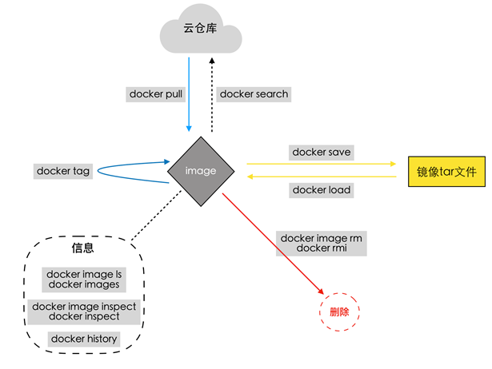
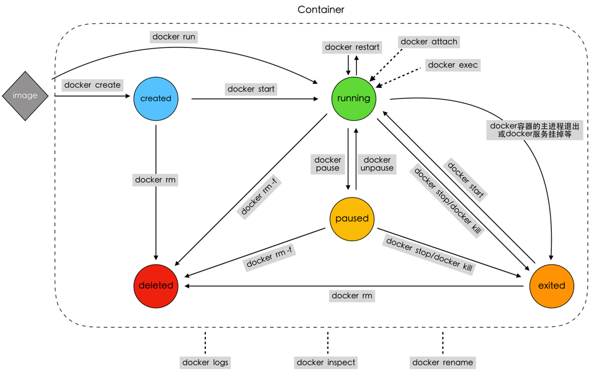

## ==1. docker基础

### 1. 1 docker简介

#### docker是什么 

​		Docker 是一个开源的应用**容器引擎**，可以获取镜像，启动相应容器。

​		它是直接运行在宿主操作系统之上的一个容器，使用沙箱机制完全虚拟出一个完整的操作，容器之间不会有任何接口，从而让容器与宿主机之间、容器与容器之间隔离的更加彻底。每个容器会有自己的权限管理，独立的网络与存储栈，及自己的资源管理能，使同一台宿主机上可以友好的共存多个容器。

#### ==docker与虚拟机对比==

 1. 重量级不同

    <font color="red">**如果物理机是一幢楼，虚拟机就是大楼中的一个个套间，而容器技术就是套间里的一个个隔断。**</font>

  2. 虚拟化技术不同

     - VMware Workstation、VirtualBoX
     
       硬件辅助虚拟化：（Hardware-assisted Virtualization）是指通过硬件辅助支持模拟运行环境，使客户机操作系统可以独立运行，实现完全虚拟化的功能。
     
     - Docker
     
       操作系统层虚拟化：（OS-level virtualization）这种技术将操作系统内核虚拟化，可以允许使用者将软件实例被分割成几个独立的单元，在内核中运行，而不是只有一个单一实例运行。这个软件实例，也被称为是一个容器（containers）、虚拟引擎（Virtualization engine）、虚拟专用服务器（virtual private servers）。每个容器的进程是独立的，对于使用者来说，就像是在使用自己的专用服务器。
       
        <font color="red">以上两种虚拟化技术都属于软件虚拟化，在现有的物理平台上实现对物理平台访问的截获和模拟。有些软件虚拟技术不需要硬件支持；而有些则依赖硬件支持。</font>
     
  3. 应用场景不同
  
      - 虚拟机擅长彻底隔离整个运行环境。如: 云服务提供商通常采用虚拟机技术隔离不同的用户。
       - Docker通常用于隔离不同的应用。例如前端，后端以及数据库。
  
  4. 资源的使用率不同
  
     - 虚拟机启动需要数分钟。占用大量磁盘空间及系统资源。
     
     - Docker容器可以在数毫秒内完成启动。
     
        由于没有臃肿的从操作系统，Docker可以节省大量的磁盘空间以及其他系统资源。

#### docker版本

- Docker-CE （社区）
  - Stable 版
      - 一个季度（3个月）更新一次。
  - Edge 版
      - 一个月更新一次。
- Docker-EE（企业版）

### 1.2 docker架构与核心组件

- ==docker架构==

  

  - 客户端
      - Linux系统的终端。键入docker 命令
      - 用来管理、操作docker服务
  - docker服务
      - 本质：守护进程（Daemon）
      - 管理 镜像、容器
  - docker镜像
      - 二进制的文件。相当于一个 “程序”
      - 很少自己来制作。从docker 官方镜像仓库中 下载。直接使用。
  - docker容器
      - 镜像运行起来之后产生的一个 “进程”。
  - docker仓库
      - docker hub。保存官方提供镜像文件。

### 1.3 docker安装和卸载

#### 安装

```shell
# 1. 联网。建议将软件源指定为“阿里云”
# 2. 更新本地软件列表。
$ sudo apt-get update
# 3. 安装插件工具。
$ sudo apt-get install apt-transport-https ca-certificates curl software-properties-common lrzsz -y
# 4. 将阿里云提供的 docker 下载公钥添加的本地信任列表。会看到 “ok” 提示。
$ sudo curl -fsSL https://mirrors.aliyun.com/docker-ce/linux/ubuntu/gpg | sudo apt-key add -
# 5. 更新本地软件列表中，docker 镜像下载源为 阿里云。
$ sudo add-apt-repository "deb [arch=amd64] https://mirrors.aliyun.com/docker-ce/linux/ubuntu $(lsb_release -cs) stable"
# 6. 重新 更新本地软件列表。
$ sudo apt-get update
# 7. 安装docker 。
$ sudo apt-get install docker-ce -y
# 8. 测试，查看安装的docker 及 版本信息。
$ docker version
```


#### ==卸载== 

```shell
# 卸载 docker命令
$ sudo apt-get remove docker
$ sudo apt-get purge docker  	# 卸载软件包的同时，删除相关操作目录。

# 手动删除 docker 相关管理目录：
1. /etc/docker: 存放用户身份相关信息。
2. /var/lib/docker: 存放镜像、容器、数据卷 等docker相关数据资源。
$ sudo rm -rf /etc/docker /var/lib/docker
```


#### 设置docker加速器(可选)

 配置加速器的原因：直接访问docker仓库下载镜像较慢。 指定一个代理。

```shell
# 1. 注册、登录 https://www.daocloud.io 点击“火箭”图标。
# 2. 向下找到 Linux对应的 Docker 镜像地址复制。在Linux系统的 "任意位置" 粘贴执行。
$ curl -sSL https://get.daocloud.io/daotools/set_mirror.sh | sh -s http://f1361db2.m.daocloud.io
# 3. 执行后会看到提示：
	{"registry-mirrors": ["http://f1361db2.m.daocloud.io"]}
	Success.
	You need to restart docker to take effect: sudo systemctl restart 				docker.service
# 4. 并且 /etc/docker/ 目录下，多出 daemon.json 文件。 
# 5. cat 查看 daemon.json 文件
	{"registry-mirrors": ["http://f1361db2.m.daocloud.io"]}
# 6. 重启 docker 服务
$ sudo systemctl restart docker
```


### 1.4 权限问题

```shell
# 默认安装好的docker，初次启动，执行docker命令时，通常会报如下错误。
lisi@itcast:~$ docker version
Client: Docker Engine - Community
 Version:           19.03.2
 API version:       1.40
 Go version:        go1.12.8
 Git commit:        6a30dfc
 Built:             Thu Aug 29 05:29:11 2019
 OS/Arch:           linux/amd64
 Experimental:      false
Got permission denied while trying to connect to the Docker daemon socket at unix:///var/run/docker.sock: Get http://%2Fvar%2Frun%2Fdocker.sock/v1.40/version: dial unix /var/run/docker.sock: connect: permission denied
```
[参考文档](https://docs.docker.com/install/linux/linux-postinstall/#systemd)
以下方案只能解决ubuntu 16.0以下版本。

```shell
# 方法1：直接使用管理员权限。（不推荐——所有执行的docker命令都需要加 sudo）
$ sudo docker version
```

```shell
# 方法2：修改当前用户，添加到docker 用户组中，来满足docker 访问权限（推荐）‘
1. 确认当前系统中含有 docker 组 （/etc/group --- docker 组ID： 999）  vi /ect/group 查看所有组 **vi /etc/passwd  查看组的所有成员

2. 将当前用户添加到 docker 组中
	$ sudo gpasswd -a ${USER} docker
	$ sudo gpasswd -a $USER docker
	$ sudo gpasswd -a lisi docker			
	** 从docker组删除
	$ sudo gpasswd -d lisi docker
3. 重启docker 
	$ sudo systemctl restart docker
4. 更新会话组，为 docker 组
	$ sudo newgrp - docker
5. 测试：
	$ docker version  --- 不会再报permission denied  错误！
```

```shell
# 方法3：修改 docker服务 使用的文件（/var/run/docker.sock）的权限
$ sudo chmod 666 /var/run/docker.sock (--给 其他人 用户添加 rw 权限)
	-- 一旦docker 服务重启，设置的权限失效。
```


### 1.5 docker服务操作命令

```shell
# 重启
$ sudo systemctl restart docker
$ sudo service docker restart
# 关闭
$ sudo systemctl stop docker
$ sudo service docker stop
# 启动
$ sudo systemctl start docker
$ sudo service docker start
# 查看状态
$ sudo systemctl status docker
$ sudo service docker status
```


---


## 2. docker镜像管理

- docker镜像，就是一个二进制文件。相当于 “程序”。 容器相当于一个进程。

### 2.1 ==镜像的搜索/获取/查看==

- 搜索镜像

  ```shell
  # 命令
  $ docker search --help
  $ docker search ubuntu   # 查询是否在 docker 官方仓库含有 ubuntu镜像
  # 字段关键字
  - NAME: 镜像名称
  - DESCRIPTION：镜像描述
  - STARS：下载量
  - OFFICIAL：是否为官方出品
  - AUTOMATED：是否使用dockerfile文件自动生成的。

  目前查看远端仓库版本号tag：只能手动https://hub.docker.com查询
  ```
  
- ==获取镜像==

  ```shell
  # 下载远程仓库（如 Docker Hub）中的镜像
  $ docker pull --help
  Usage:	docker pull [OPTIONS] NAME[:TAG|@DIGEST]
  
  $ docker pull 镜像名
  # 镜像存储目录
  /var/lib/docker 目录中，将镜像文件，打散成多个子文件，分别加密存储。
  
  /etc/docker/                #docker的认证目录
  /var/lib/docker/            #docker的应用目录
  
  # 版本信息：
  1. 默认：下载时，不指定Tag， 下载最新版本
  2. 指定tag：1）latest表下载最新版。 2）用Tag指定版本号信息
  ```
  
- ==查看本地镜像==

  ```shell
  # 命令
  $ docker images 或 $ docker image ls  --- 查询本地镜像仓库中的所有镜像。
  
  # 字段关键字
  - REPOSITORY: 本地镜像仓库中的镜像名称
  - TAG： 版本信息。
  - IMAGE ID： 镜像 ID
  - CREATED：镜像被创建的时间（不是下载时间）
  - SIZE：镜像大小
  
  # 查看某一个镜像
  $ docker images ubuntu
  不能一次性查看多个。$ docker images ubuntu redis -- 不可以！！
  ```

### 2.2 镜像别名/删除

- 镜像别名

  ```shell
  $ docker tag --help
  $ docker tag 源镜像名[版本（默认latest）]  新镜像名[版本（默认latest）]
  $ docker tag ubuntu ubt-1:v1.0
  	新镜像与原镜像具有 相同的 镜像ID
  ```
  
- ==删除镜像==

  ```shell
  $ docker rmi --help
  $ docker rmi 镜像名/镜像ID[:tag]
  $ docker image rm 镜像名/镜像ID[:tag]
  
  	tag: 如果镜像的版本不是 latest， 不能省略tag。
  	-f, --force : 强制删除
  $ docker rmi ubuntu  # 只能删除tag为 latest 的镜像
  $ docker rmi ubuntu:v1.0  # 能删除tag为v1.0 的镜像
  $ docker rmi -f 2ca708c1c9cc  # 有相同镜像ID的镜像，会被强制全部删除。
  ```

### 2.3 镜像的导入导出

- ==镜像导出==

  ```shell
  $ docker save --help
  $ docker save -o 镜像名.tar.img  源镜像名
  	-o, --output: 指定导出的镜像名称。
  $ docker save -o ./docker_test/myrds.tar.img redis:latest # 生成镜像，保存到指定目录
  $ docker save -o myRedis2.tar.img redis # 生成镜像，保存到当前目录
  ```
  
- ==镜像导入==

  ```shell
  $ docker load --help
  $ docker load -i 镜像名.tar.img 
  $ docker load < 镜像名.tar.img
  # 方法1：
  $ docker load -i myrds.tar.img
  # 方法2：		
  $ docker load < myrds.tar.img
  ```

### 2.4 镜像历史和详细信息【了解】

- 查看镜像历史记录

  ```shell
  # 镜像制作过程中，经历的步骤
  $ docker history -- help
  $ docker history 镜像名称/镜像ID
  ```

- 查看镜像详细信息

  ```shell
  # 镜像的属性信息, 以json格式输出
  $ docker inspect --help
  	-f, --format: 输出指定字段信息。
  $docker inspect nginx
  $docker inspect -f {{.}} nginx
  $docker inspect -f {{.ContainerConfig.Hostname}} nginx
  
  # https://yq.aliyun.com/articles/230067
  ```

### 2.6 总结



```shell
# 整体 docker 镜像操作
语法： docker subcmd --help
	subcmd：
		- search
		- pull
		- tag
		- save
	    - 。。。
```


---


## 3. docker容器管理

docker将镜像文件启动, 得到一个容器, 一个容器可以被看做一个操作系统

### 3.1 ==容器的查看/创建/启动==

- ==查看容器信息==

  ```shell
  # 命令
  $ docker ps --help  查看运行状态的容器信息。
  # 参数
   -a, --all: 显示所有容器 
   -q: 只显示容器ID
   
  # 字段关键字
  - CONTAINER ID： 容器ID
  - IMAGE：用来创建容器的镜像名
  - COMMAND：容器启动后，锁需要执行的第一条命令。 通常没有合适的命令，键入“bash”
  - CREATED：容器创建的时间
  - STATUS：容器运行状态：
  		- 运行：Up
  		- 创建：Created
  		- 停止：Exited
  		- 暂停：Paused
  - PORTS: 对外开放的端口。
  - NAMES：容器的名称。
  	- 如果创建容器时，没有指定名，自动随机生成一个名称。
  	- 如果指定了名，按用户指定来命名。
  ```
  
- ==创建容器==

  ```shell
  # 创建容器，但尚未启动，不能使用。
  $ docekr create --help
  docker create [OPTIONS] IMAGE [COMMAND] [ARG...]
  #docker run   [OPTIONS] IMAGE [COMMAND] [ARG...]
  $ docker create -it --rm --name 容器名 镜像名[:tag] 命令
  
  - [OPTIONS]:
  	-i, --interactive: 开启stdin。与用户交互。接收客户端输入数据
  	-t, --tty: 关联终端（stdout、stderr）
  	--rm: 指定该参数创建容器时，当容器退出运行后，会自行销毁。
  	--name: 指定容器名。
  - IMAGE: 生成容器使用的 镜像
  - [COMMAND] [ARG...]：容器启动后执行的第一条命令。
  
  # 测试
  $ docker create -it --rm --name ubt-rm ubuntu:latest bash
  ```
  
  
  
- 启动创建好的容器

    ```shell
    # 命令
    $ docker start --help
    -a：指定关联 stdout、stderr
    -i：指定标准输入stdin
    $ docker start -ai 容器名/容器ID
    
    # 应用场景
    1. 创建好了容器，尚未启动。
    2. 已经运行过的容器，被停止。重新启动。
    
    # 测试
    docker start -ai ubt-rm   # ubt-rm 容器 非Up状态(Created、Exited)
    ```

    

- ==创建、启动一步处理==

    ```shell
    # 命令
    $ docker run --help
    $ docker run -it --rm --name 容器名 镜像名[:tag] 命令
    # 字段关键字
    - [OPTIONS]:
    	-i, --interactive: 开启stdin。与用户交互。接收客户端输入数据
	-t, --tty: 关联终端（stdout、stderr）
    	-d, --detach: 与前台分离（不直接与用交互），运行与系统后台，显示容器ID
    	--rm: 指定该参数创建容器时，当容器退出运行后，会自行销毁。
    	--name: 指定容器名。
    - IMAGE: 生成容器使用的 镜像
    - [COMMAND] [ARG...]：容器启动后执行的第一条命令。
    
    # 测试
    $ docker run -itd --name ubt-1 ubuntu bash # 创建容器运行与后台
    $ docker run -it --name ubt-2 ubuntu bash # 创建容器运行在前台
    $ docker run -it --rm --name ubt-3 ubuntu bash # 创建容器运行在前台，退出时自动销毁
    ```
    
    

### 3.2 容器的暂停/重启【了解】

- 暂停

  ```shell
  $ docker pause --help
  $ docker pause 容器名/容器ID  —— 状态：Up 9 minutes (Paused)
  ```

- 取消暂停

  ```shell
  $ docker unpause --help
  $ docker unpause 容器名/容器ID  —— 状态：Up 9 minutes 
  ```

- ==重启==

  ```shell
  $ docker restart --help
  $ docker restart 容器名/容器ID  -- Created、Exited、Paused、Up 可以重启
  ```


### 3.3 容器的关闭/终止/删除

- 关闭

  ```shell
  $ docker stop --help
  	-t，--time：指定一个时长，等待容器回收资源再关闭。
  $ docker stop ubt-1
  ```
  
- 终止

  ```shell
  # 不会销毁容器。 也是关闭操作。通过发送信号方法关闭容器。
  $ docker kill --help
  $ docker kill ubt-1
  ```
  
- ==删除==
  
- 删除未运行的容器 
  
    ```shell
    $ docker rm --help  （docker rmi 删除镜像）
  	-f,--force: 强制删除
    $ docker rm 容器名/容器ID	
  ```
  
  - 删除运行的容器
  
  ```shell
    $ docker rm -f 容器名/容器ID	
  ```
  
  - 批量删除容器
  
    ```shell
    $ docker rm -f b9e107ef069e 072739ced407  #指定多个容器名、容器ID
    $ docker rm -f $(docker ps -q)  # 取所有的容器ID， 传给 rm -f 删除
    $ docker rm -f `docker ps -q`  # 取所有的容器ID， 传给 rm -f 删除
    ```


### 3.4 容器的进入/退出

- 进入容器

  - ==手动进入==

    ```shell
    $ docker exec --help
    	-i：stdin
    	-t：tty终端
    $ docker exec -it 容器名/容器ID	命令
    $ docker exec -it 62dc7e152d3a bash
    ```
    
  - 创建并进入

    ```shell
    $ docker run -it --name 容器名 镜像名 命令
    ```

- 退出容器

  ```shell
  exit、Ctrl-D
  ```

### 3.5 容器的日志/详细信息/端口/重命名【了解】

- 查看容器日志信息

  ```shell
  $ docker logs 容器名/ID   # 新创建的容器没有日志信息正常。
  ```

- 查看容器详细信息

  ```shell
  # 与查看镜像的详细信息同
  $ docker inspect 容器名/ID
  	# 详细信息的组织方式：json。 参考 镜像查看。
  	
  # https://yq.aliyun.com/articles/230067
  ```

- 查看容器端口信息

  ```shell
  # 查看本机和容器的端口映射
  $ docker port --help
  $ docker port 容器名/ID
  ```

- 容器重命名

  ```shell
  $ docker rename 原容器名  新容器名
  $ docker rename musing_mirzakhani Ubuntu_TEST
  ```


### 3.6 总结



