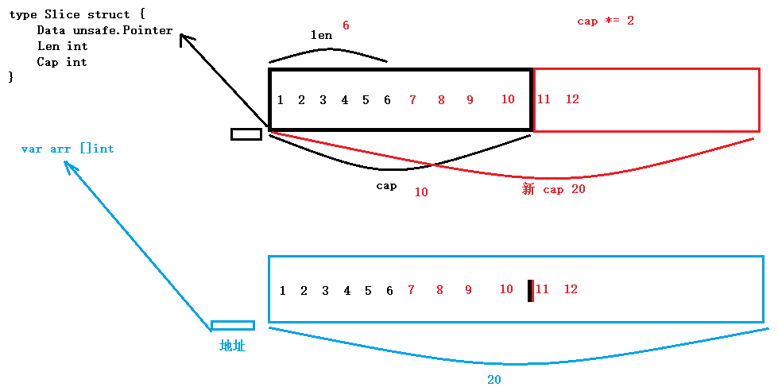
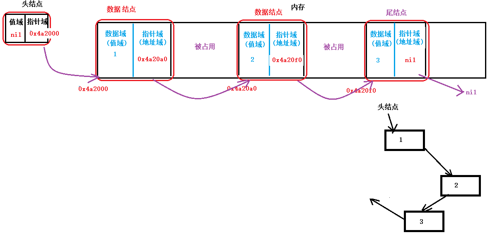

## 数据结构和算法

### 概念

- 数据结构：
    - 数据存储，组织的基本方式，是数据的载体，算法实现基础。
- 算法：
    - 针对存储好的数据，对既定问题的求解步骤。
- 程序 = 数据结构 + 算法。

### 算法分类

1. 分治法（分步治理）：有明确的目标，有既定的执行方式。将大问题拆分成小问题，逐一解决，组织执行流程合并。—— 应用程序开发

2. 最短路径法：有明确的目标，没有既定的 执行方式，根据实际情况分析，找寻执行方式。—— 游戏领域

3. 贪婪、贪心算法：没有明确的目标，没有既定的执行方式。找寻执行方式。 —— AI

    

### 算法特性：

1. 输入：0-N输入数据
2. 输出：1-N输出数据
3. 有穷性：算法应该在执行有限步骤后结束，不能无限循环。
4. 确定性：算法的含义明确，不能出现二义性。
5. 可行性：算法的每一步求解都是可以执行。


### 数据结构的分类

#### ==逻辑结构划分==

1. 集合结构：数据元素之间 无序、不重复、散落存储。
2. 线性结构：数据元素之间 存在 1:1 比例关系。  数组、切片、链表。
3. 树形结构：数据元素之间 存在 1：N 比例关系。二叉树、多叉树。
4. 图形结构：数据元素之间 存在 N：N 比例关系。网络。


#### ==物理存储结构划分==

- 顺序存储：—— 线性
    - 数据存放在连续的内存单元中，数据类型一致。
    - 检索元素效率高，增、删效率低下。
- 链式存储：—— 线性
    - 数据可以存放在散乱的内存单元中，数据类型一致。建立元素之间的 指向关系。
    - 检索元素效率低，增、删效率高。


## 线性顺序存储 —— 切片

### ==切片本质==

```go
type Slice struct {
    Data unsafe.Pointer 	// go系统提供的 万能指针类型。 C语言万能指针 void *
    						// 不是具体的指针类型，不能进行数据运算、解引用。
    Len int					// 元素的 实际有效长度
    Cap int 				// 容量
}
```


### 切片存储原理



### C语言获取内存


 #### C 操作函数

```C
#include <stdlib.h>

void *malloc(size_t size)	// 申请内存空间。
    size：申请的内存空间大小。单位：字节
    void *： 申请成功的 空间首地址。
    
void free(void *ptr)   
    ptr:释放的内存首地址。（malloc函数的返回值）
    
void *realloc(void *ptr, size_t size)   // 拓展内存空的大小 
	ptr：待拓展的空首地址（malloc函数的返回值）
	size：拓展后的空间总大小。单位：字节
	void *: 拓展后的空间,首地址
```


#### C语言函数示例

```c
#include <stdlib.h>
#include <stdio.h>

int main(void)
{
	int *p = NULL;

	// 申请内存
	p = (int *)malloc(100);			// void * 可以转换为任意指针类型

	// 写数据到内存
	*p = 979;

	// 从内存读数据
	printf("*p= %d, p = %p\n", *p, p);	

	// 拓展 内存空间
	int *q = realloc(p, 200);
	*q = 748329;
	printf("*q= %d, q = %p\n", *q, q);	

	// 释放内存
	free(p);
	free(q);

	return 0;
}

```


#### ==Go程序使用C函数==

1. 在多行注释中，添加使用程C函数对应的头文件 `/* #include <stdlib.h> */`
2. 添加导入C语言包。 `import C` （上述的include 会高亮）
3. 在go程序中，使用C.函数名(实参列表) 调用c语言函数。 `C.malloc(10)`


### 实现切片数据结构

#### 切片操作函数

1. 创建切片数据结构 Create（长度， 容量， ... 数据）
2. 打印切片 Print()
3. 追加元素 Append( ... 数据)
4. 获取切片元素 GetData(下标) int
5. 查找切片元素 Search(数据) 下标
6. 插入元素到切片中 Insert(数据, 下标)
7. 删除切片中的元素 Delete(下标)
8. 销毁切片 Destroy()

#### ==创建切片==

- 实现思路流程：

    1. 容错

    2. 创建 切片结构体 

        - ```g
            type Slice struct {
            	Data unsafe.Pointer //不能运算,不能解引用,相当于 c void *
            	Len  int
            	Cap  int
            }
            ```

    3. 按用户指定的 len、cap 、赋值结构体 成员。

    4. 使用 C.malloc() 按用户指定的容量申请内存。注意单位：字节

        - malloc(C.size_t(cap)  *  8)
        - 得到是 void * 地址值。保存给 s.Data

    5. 将 指针类型，转为数值类型。方便后续 指针移动 (+法)。 uintptr()

    6. 循环提取用户输入数据。 写入到 内存中

        - 将 数值类型 转回成指针（void *）.---> unsafe.Pointer()
        - 强制类型，转换成具体数据类型。（*int）
        - 解引用。取内存空间（左值）

    7. 循环结束，切片对象创建成功。

- 编码实现

```go

/*
#include <stdlib.h>
 */
import "C"

import (
	"unsafe"
	"fmt"
)

const TAG = 8

type Slice struct {
	Data unsafe.Pointer //不能运算,不能解引用,相当于 c void *
	Len  int
	Cap  int
}

// 创建切片方法
func (s *Slice) Create(l int, c int, Data ...int) {
	// 容错
	if s == nil {
		return
	}
	if l < 0 || c < 0 || l > c || len(Data) > c {
		return
	}

	// 初始化 Len/Cap
	s.Len = l
	s.Cap = c

	// 按用户指定的容量, 申请内存空间,保存在 s.Data 中. 包存的 void * 类型的指针
	s.Data = C.malloc(C.size_t(c) * TAG)

	// 将指针(地址)转换程可以计算的数值
	p := uintptr(s.Data)

	// 循环获取用户传入的 数据,依次写入s.Data 对应的内存
	for _, v := range Data {
		// 将数值类型的 p 转换地址
		*(*int)(unsafe.Pointer(p)) = v	// 使用强制类型转换, 具体指针数据类型
		p += TAG
	}
}
```


#### 打印切片

```go
// 打印切片方法
func (s *Slice) Print() {
	// 容错
	if s == nil || s.Data == nil {
		return
	}
	// 将 地址 转成 数值
	p := uintptr(s.Data)

	// 按切片的有效数据个数, 循环读取 s.Data 对应内存中的数据
	for i := 0; i < s.Len; i++ {		// 该循环,决定 p 偏移的 次数.
		fmt.Print(*(*int)(unsafe.Pointer(p)), " ")
		p += TAG		// 指针后移
	}
	fmt.Println()
}
```


#### ==追加切片元素==

- 实现思路：
    1. 容错
    2. 判断 是否需要扩容 s.Len + len(Data) > s.Cap
        - 如果需要：
            - 使用 realloc，拓展 s.Data 内存空间。x2 
            - s.Data = realloc(s.Data, C.size_t(s.Cap) * 2 * TAG)
            - 修改 切片结构体的 Cap 域。x2 
    3. 不需要
        - 将指针 --> 数值
        - 将指针，指向最后一个元素之后。`p += uintptr(s.Len) * TAG`
        - 循环取出数据，依次写入内存
        - 修改 s.Len 

- 代码实现：

```go
// 追加切片元素方法
func (s *Slice) Append(Data ...int) {
	// 容错

	// 判断, 追加后, 是否会超出 cap 值

// --- 超出
	// 拓展 cap 为原来的 2 倍. ---- realloc()

	// 修改 cap / Len

// --- 没有超出现有容量

	// 将 地址--> 数值

	// 将 地址 移动至 切片最后一个元素之后.

	// 循环取出用户输入的数据

		// 将数值,转回程指针(强转) , 将数据写入内存

	// 修改 Len
}

// 追加切片元素方法
func (s *Slice) Append(Data ...int) {
	// 容错
	if s == nil {
		return
	}
	if len(Data) == 0 {
		return
	}

	// 判断, 追加后, 是否会超出 cap 值
	for s.Len + len(Data) > s.Cap {		// --- 超出
		// 拓展 cap 为原来的 2 倍. ---- realloc()
		s.Data = C.realloc(s.Data, C.size_t(s.Cap) * 2 * TAG)
		// 修改 cap / Len
		s.Cap *= 2
	}

	// --- 没有超出现有容量
	p := uintptr(s.Data)  // 将 地址--> 数值

	// 将 地址 移动至 切片最后一个元素之后.
	p += uintptr(s.Len) * TAG

	// 循环取出用户输入的数据
	for _, v := range Data {	// 控制指针p后移的次数

		// 将数值,转回程指针(强转) , 将数据写入内存
		*(*int)(unsafe.Pointer(p)) = v
		p += TAG
	}

	// 修改 Len
	s.Len += len(Data)
}
```


#### 获取切片元素

```go
// 获取切片元素
func (s *Slice) GetData(index int) int {
	// 容错
	if s == nil || s.Data == nil {
		return -1
	}
	if index < 0 || index >= s.Len {
		return -1
	}
	// 地址 --- 数值
	p := uintptr(s.Data)

	// 移动到 index 对应的内存
	p += uintptr(index) * TAG

	return *(*int)(unsafe.Pointer(p))
}
```


#### 查找切片元素

```go
// 查找切片中的元素
func (s *Slice) Search(Data int) int {
	// 容错
	if s == nil || s.Data == nil {
		return -1
	}

	// 地址 --- 数值
	p := uintptr(s.Data)

	// 循环取出切片中的元素, 与参数 Data 比较, 返回结果
	for i := 0; i < s.Len; i++ {
		if *(*int)(unsafe.Pointer(p)) == Data {
			return i
		}
		p += TAG			// 指针后移
	}
	return -1
}
```


#### ==删除切片中的元素==

- 思路：
    1. 容错
    2. 地址 --- 数值
    3. 获取 index 对应的内存地址。 保存在 p 中
    4. 从 index 开始循环，遍历 index 后续元素， 依次前移（后一个元素，给前一个元素赋值）
    5. 更新 Len。 （将最后一个多余的 元素，丢弃。）
- 代码：

```go

// 删除切片中的 指定元素
func (s *Slice) Delete(index int) {
	if s == nil || s.Data == nil {
		return
	}
	if index < 0 || index >= s.Len {
		return
	}

	// 地址 -- 数值
	p := uintptr(s.Data)

	// 偏移至index 位置
	p += uintptr(index) * TAG

	aftp := p

	// 循环,将index 之后的元素,后移 (后一个元素,给前一个元素赋值)
	for i := index; i < s.Len; i++ {
		aftp += TAG
		// aftp 指向的内存,给 p 指向的 内存,赋值
		*(*int)(unsafe.Pointer(p)) = *(*int)(unsafe.Pointer(aftp))
		p += TAG
	}

	// 修改 s.Len
	s.Len -= 1
}
```


#### ==插入元素到切片中==

- 实现思路
    1. 容错
    2. 判断，如果插入位置在，结尾。 调用 Append() 
    3. 判断，如果插入元素后，容量超出，拓展。—— 参考 Append() 实现。
    4. 定义变量p， 保存 index 对应的内存地址。
        1. 指针 --- 数值。 uintptr
        2. 偏移 到 index 对应内存位置。 p += TAG*index
    5. 定义变量tmp，用来实现 index 之后元素的 移动操作
        1. tmp = uintptr(s.Data) + uintptr(s.Len) * TAG   将 tmp指向尾元素之后的位置。
        2. 循环将 index 之后的元素，依次赋值。前一个元素，给后一个元素赋值。
    6. 将 p 保存的位置，写入 参数传入的 Data
    7. 更新 s.Len
- 代码

```go
// 插入元素到切片指定位置
func (s *Slice) Insert(Data, index int) {
	if s == nil || s.Data == nil {
		return
	}
	if index < 0 || index > s.Len {
		return
	}

	// 如果插入位置,在切片结尾处
	if index == s.Len {
		s.Append(Data)
		return
	}

	// 如果插入位置在中间
	// 判断,插入后,是否需要扩容
	if s.Len + 1 > s.Cap { // --- 超出
		// 拓展 cap 为原来的 2 倍. ---- realloc()
		s.Data = C.realloc(s.Data, C.size_t(s.Cap)*2*TAG)
		// 修改 cap / Len
		s.Cap *= 2
	}

	// 地址 -- 数值
	p := uintptr(s.Data)

	// 保存 index 对应的内存地址
	p += uintptr(index) * TAG

	// 定义变量 tmp , 用来移动 index 后序元素.

	tmp := uintptr(s.Data) + uintptr(s.Len)*TAG // 将 tmp 指向切片尾元素的后一个位置.

	// 从后向前循环,前一个元素,给后一个元素赋值.
	for i := s.Len; i > index; i-- {
		// 前一个元素,给后一个元素赋值
		*(*int)(unsafe.Pointer(tmp)) = *(*int)(unsafe.Pointer(tmp-8))
		tmp -= TAG			// 指针前移
	}

	// 在index 位置写入,新插入数据值
	*(*int)(unsafe.Pointer(p)) = Data

	// 更新有效长度
	s.Len++
}
```


#### 销毁切片对象

- 被置空的对象（没有引用），会被垃圾回收机制择机处理。

```go

func (s *Slice) Destroy() {
	if s == nil {
		return
	}
	// s = nil

	if s.Data != nil {
		C.free(s.Data)
	}
	s.Data = nil
	s.Len = 0
	s.Cap = 0
	s = nil
    runtime.GC()
}
```


## 线性链式存储 —— 链表

- 种类：
    - 单向链表 
    - 双向链表
    - 循环链表

### ==单向链表数据结构==



- 头结点：（非必须）数据域为空， 指针域指向第一个数据结点。（没有前驱，有后继）
- 数据结点：（必须）数据域、指针域均不为空。（既有前驱，又有后继）
- 尾结点：（也是数据结点）数据域非空，指针域为nil。(有前驱，无后继）。

#### ==存储结构==

```go
type LinkNode struct {
    Data interface{}			// 数据域（值域）
    Next *LinkNode				// Next LinkNode 这种定义错误！无法开辟内存。
}
```


### 单向链表操作函数

1. 创建单向链表 Create(...数据 interface{})
2. 打印单向链表 Print()
3. 获取单向链表的长度 Length()
4. 单向链表插入——头插法 InsertByHead()
5. 单向链表插入——尾插法 InsertByTail()
6. 单向链表插入——按位置插入 InsertByIndex()
7. 删除链表结点——按位置删除 DeleteByIndex()
8. 删除链表结点——按数据删除 DeleteByData()
9. 按数据插找结点 SeachByData()
10. 销毁链表 Destroy()

### ==创建单向链表==

- 实现思路

    1. 创建链表结点 结构体。

        - ```go
            // 定义链表的结点结构体
            type LinkNode struct {
            	Data interface{} // 数据域（值域）
            	Next *LinkNode   // Next *LinkNode
            }
            ```

    2. 容错

    3. 【提示】：

        1. 调用 Create 函数的 node ，采用的 值（地址值）传递。在create 内修改的都是 拷贝份。
        2. node 当做 “当前结点” 称呼。

    4. 循环 获取用户键入的数据，创建新结点

        1. newNode = new(LinkNode)
        2. 初始化 数据域 
        3. 初始化 指针域 nil

    5. node.Next = newNode     // 将当前结点的下一结点，赋值为 新结点

    6. node = node.Next             // 更新新结点为当前结点。


- 代码实现

```go

// 定义链表的结点结构体
type LinkNode struct {
	Data interface{} // 数据域（值域）
	Next *LinkNode   // Next *LinkNode
}

func (node *LinkNode) Create(Data ...interface{}) {
	// 容错
	if node == nil || len(Data) == 0 {
		return
	}
	// node 为 "当前结点"
	// head := node 			// 定义头结点, 保存当前结点

	// 遍历用户输入的数据, 创建结点,保存到数据域
	for _, v := range Data {
		// 创建新结点
		newNode := new(LinkNode)
		newNode.Data = v
		newNode.Next = nil

		node.Next = newNode		// 当前结点的下一个结点, 赋值为新结点
		node = node.Next		// 更新当前结点为 新结点.
	}
	//node = head
}

func main() {
	list := new(LinkNode)

	list.Create(1, 2, 3, 4, 5)

	fmt.Println(list)
}
```

